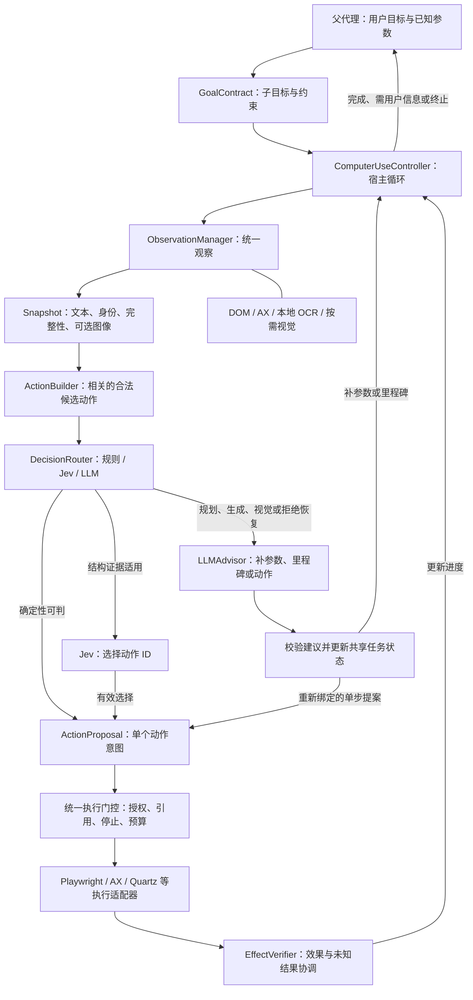
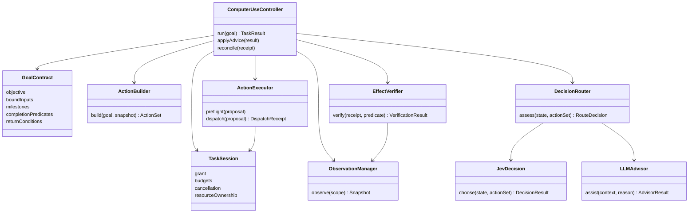
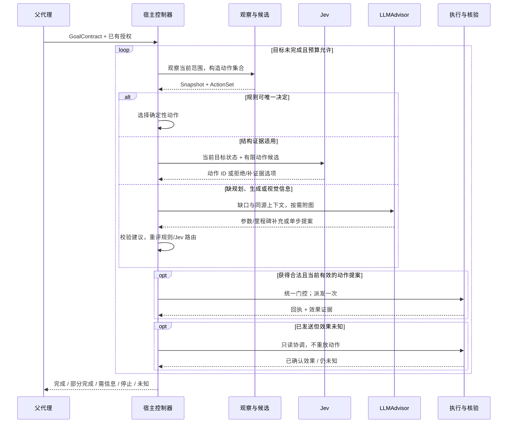
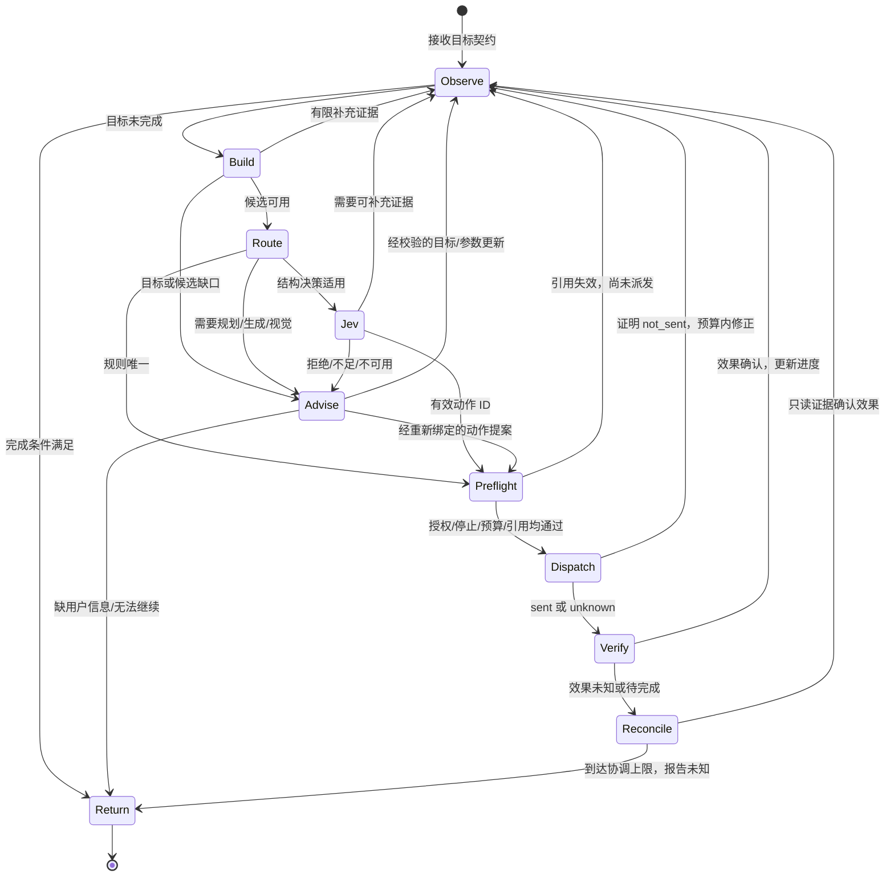

> 状态：进行中（2026-09-28 综合讨论修订；S0–S6 尚未开工）。
> 目标设计尚未实现、尚未实机验收。生产默认与基线 A 不变，新子代理显式 opt-in。

# 计划：Computer Use 子代理的宿主循环与策略阶梯（S0–S6）

## 1. 目标、范围与本次决策

目标是在不降低任务完成和执行可靠性的前提下，减少界面操作中的主 LLM 往返、
图像上传与总等待时间。采用 **宿主驱动循环：规则直接处理确定性步骤，适用的
结构化决策优先 Jev，需要规划、生成或视觉理解时调用 LLM，补齐信息后重新评估并回到快速路径**。

两条选择轴分开设计：

- **谁作决策**：规则 / Jev / LLM；LLM 不再默认每步规划，Jev 不再仅是 D2 控件选择器。
- **如何观察和操作**：Playwright/DOM、macOS AX（即 Accessibility）、OCR、视觉。
  LLM 也可以只读 DOM 文本；Jev 也可以选择 OCR 候选。不能把 LLM 等同于截图点击。

“结构信息足够”指当前目标和决策所需证据足够，不是有一棵 AX/DOM 树就放行。
Jev 负责选择，宿主负责授权、动作构造、状态、派发和完成核验。
目标是成功任务的端到端效率，不是最大化 Jev 使用率。

本次取代 2026-09-26 版“LLM 每步提出 StepIntent、Jev 仅条件性 D2 实验”的目标架构；
D2 回放仍作为阶段验收，但不再是最终范围上限。S0 起即建立目标级宿主循环，
S3 接入 Jev，S4 验证多步目标和 LLM 介入后继续执行，S5 再评价采用收益。

依据：[调研](../../research/computer-use-strategy-ladder.md)、
[现行设计](../../design/computer-use.md)、
[M8 收口](../../../backend/benchmarks/computer_use/reports/20260925-m8-closeout/README.md)。
M8 的真实任务失败还涉及规划、流程和预算，不能把定位正确率当作任务成功率。
本文件包含未来设计和实施计划；现行设计文档只在能力实际落地后更新。

**复用资产**：M2 frame/image 与显示器映射、M7 AX、GroundingAdapter、AgentRunner、
SubAgentContext、执行白名单、审批、停止清理、SpendLedger 与独立 benchmark。
本计划已收编 [backlog](../../backlog.md) 的 OCR/编号预检、AX 选择复验。
保留已落地的多显示器身份与 crop 语义；M2 窗口完整位于一台活跃显示器，
AX 副屏效果仍需单列验收，不从几何支持推定。

**非目标**：N2/SDK 引擎改造、Linux、Safari safaridriver、任意用户 profile 接管、
新增业务 API/CLI、原生 computer 协议/UI-TARS、通用历史压缩、动态几何高频压测。
当前范围内的引用过期、图像历史、焦点与迟到回包处理不能因此省略。

## 2. 界面操作架构

### 2.1 父代理、子代理、模型与执行器

父代理理解用户任务并通过既有 agent 委派入口交付目标。Computer Use 子代理由
`ComputerUseController` 持有循环，不把长时运行交给一个无限的 LLM tool loop。
名字表示职责，不能据类图机械地一类建一个文件。



静态总览：[架构 PNG](../../assets/computer-use-strategy-ladder/04-architecture-diagram.png)
· [SVG](../../assets/computer-use-strategy-ladder/04-architecture-diagram.svg)。
PNG 可用 macOS「预览」打开，SVG 可用浏览器打开，不依赖 Canvas。

### 2.2 UML 类图：逻辑职责



[类图 PNG](../../assets/computer-use-strategy-ladder/01-class-diagram.png)
· [SVG](../../assets/computer-use-strategy-ladder/01-class-diagram.svg)。

### 2.3 现有代码接缝与模块边界

现有 `LLMAgent._get_tools()` 与 `AllowlistExecutor` 已把“提供给模型的工具”
和“允许执行的工具”对齐，但列表在一次 run 开始时生成，并非逐界面动态重建。
现有 grounding 分支围绕 screenshot/locate/reference action；这些不是新循环已经实现的证据。

S0 在 AgentRunner 的内建 opt-in 分支接入控制器，继续复用任务上下文、AgentOutput
事件、授权与清理生命周期。LLMAdvisor 是有预算的按需调用，不再次启动拥有独立
预算和副作用出口的子代理。生产 A、split/ax/integrated、N2/SDK 路径保持隔离。

建议落点，以 S0 接缝测试确认：

- `agents/computer_use_controller.py`：目标/里程碑状态、路由、返回条件、模型协作。
- `tools/computer_ladder.py`：共享观察/命令入口、typed refs、单步定位执行与核验接缝。
- `tools/computer_dom.py`、`tools/computer_ocr.py`：一个 Playwright 路径、一个 Vision OCR 后端。
- `computer_ax.py`、`computer_frame.py`：稳定身份、当前有效性与既有宿主映射。
- 小范围决策适配模块：规则、Jev 请求/结果、LLMAdvisor；不建立所有业务通用的 D1–D5 框架。

## 3. 提供给 LLM 的接口与一致的数据结构

### 3.1 工具接口和宿主内部能力

父代理看到的是“委派 computer-use 目标”和既有状态/停止入口，不必逐个调用 OCR、
Jev 或 Playwright。子代理内 LLMAdvisor 可使用稳定的四类语义命令面，名称为设计草案：

- `launch_app(app)`：在授权范围打开/激活应用，宿主绑定身份并自动返回初始观察。
- `observe(scope, focus?, detail=auto)`：只读观察，可请求局部细节；宿主决定传感器与图像附件。
- `act(scope, observation_id, action, target, value?, expected_effect?)`：
  提出一个动作，action 为有限枚举，target 为语义目标或本次宿主引用。
- `wait(scope, condition, timeout)`：有限等待和只读回查；condition 使用支持的条件类型。

上述命令可通过 function calling 表达；模型调用只形成提案，统一命令入口负责实际执行。
Advisor 每次调用至多接受一个副作用提案，随后归还宿主循环；补充观察也有次数和时间上限。
它还可用结构化回复提出 `goal_patch`、`need_observation`、`needs_user_input` 或 `unable`。
不得提供可绕过约束的 shell、任意页面脚本、裸坐标点击或模型自行调用 Jev 的第二条通路。

工具 schema 首期保持稳定，状态通过 `allowed_next_ops` 与拒绝原因反馈；提示仅辅助模型。
执行时再次校验工具白名单、参数、当前状态、作用域和授权。即使工具在上轮可用，
观察过期或结果待协调时也不能执行。多个副作用调用不并发投递到同一桌面会话。

OCR/AX/Playwright/Jev 默认是内部服务，不必变成主 LLM 的独立工具。
观察只收集证据，绝不因为识别到按钮就点击；`act` 内部可复用观察、选择和核验服务。

### 3.2 GoalContract：可验证子目标

父代理可以直接给出完整契约；若只有自然语言任务，先保留原任务与授权，按需调用
Advisor 补齐契约。不能为每个已经清楚的简单任务强制增加一次“目标整理”LLM 请求。

契约包括：

- 宿主分配的 task/goal id、版本、父目标关联及原始用户意图；
- objective、已绑定输入值/内容引用、允许的应用/页面/预期对话框；
- 语义里程碑及必要依赖，而非固定坐标点击列表；
- 可支持且与原目标一致的完成条件、允许副作用及已有授权引用；
- 返回条件：缺参数/用户意图、候选不足、未知状态或副作用、无进展、预算/停止。

粒度按“目标可验证、关键参数已定、当前能形成有限候选、异常能返回”判断，
不固定为几个点击。简单任务可整体委派；陌生流程先短目标，实际证据充分后再扩大。
页面切换不必升级模型；出现新的业务选择才是重要边界。跨应用继续必须事先在范围内。

示例：把当前文档导出 PDF 至已确定目录，文件名已给定，不覆盖已有文件。
里程碑为进入导出界面、设置格式/路径、保存、核验本次产物；不能只凭同名旧文件存在判完成。
若没有获准的文件读回能力，则用可用应用证据，证据不足返回 unknown，不能偷增文件权限。

LLM 的 goal_patch 不得扩大授权、重置预算、删除未知回执，或把原完成条件改弱来宣告完成。
父目标拆分后仍汇总所有子目标和实际效果；新的业务决定返回父代理，只有缺用户信息才询问用户。

### 3.3 Snapshot：统一外壳，按需内容

每次模型输入沿用同一版本化结构；DOM、AX、OCR 不强行伪装为同一种原生对象。
初期使用有范围的完整快照，增量协议属于实测后优化，避免过早引入漏更新问题。

```json
{
  "schema_version": 1,
  "observation_id": "obs-42",
  "scope_ref": "window-7",
  "generation": 3,
  "status": "ready",
  "summary": "文档窗口，导出菜单已展开",
  "capabilities": {"dom": "unavailable", "ax": "available"},
  "focus_ref": null,
  "elements": [
    {"ref": "target-12", "kind": "control", "role": "menuitem",
     "label": "导出 PDF", "source": "ax", "actions": ["click"]}
  ],
  "completeness": {"scope": "export-menu", "truncated": false},
  "allowed_next_ops": ["observe", "act", "wait"],
  "images": []
}
```

内部还保留 session、应用/窗口/page/frame 身份、观察时间、原生版本/导航代次、
crop/display/image 元数据、祖先与上下文、来源和可执行性证据。
`images` 为已绑定图像附件的描述/引用；仅给文件路径字符串不算模型已经看到图片。

规则/Jev/LLM 使用同源状态的不同视图：主 LLM 看目标相关摘要，Jev 看当前问题和候选，
宿主保留可追溯的完整范围。界面内容一律作为不可信数据，不可改写任务或外发授权。
OCR 文字框标为 text_region，不能自动变成可点击 control。
本地截图留档不等于模型图片输入；OCR 可以全程本地而模型只接收文字。

只在需要视觉理解/定位/核验时附局部图像。阶梯不沿用固定 ImageBlock 的
`LocateSession.feedback()`；过期图像不默认反复发送，保留动作、结果及观察 id。
通过真实 SDK 序列化/HTTP 测试验证当前请求和后续历史中的图像。生产 A 历史不变。

### 3.4 候选动作、模型回复与执行结果

- `ActionSet`：绑定 goal_version、observation_id、candidate_set_id、作用域和截断标志。
  候选从角色/当前值/上下文/当前里程碑及已知参数生成，不读取 benchmark 真值。
- `ActionProposal`：宿主生成 id，绑定动作、TargetRef、参数引用、前置条件、
  预期效果和效果类别。Jev 选择整条动作 id，不分别任意拼接 action/target/value。
- `TargetRef`：DomRef 保留 context/page/frame/locator；AXRef 保留应用/窗口/原生元素；
  ImagePointRef 保留 session/frame/display/crop/图像点。展示行号不是身份。
- `DecisionResult`：candidate_id / none / ambiguous / need_more_context / escalate；
  后四项是宿主显式列出的控制选项，不是假定 Jev 原生返回这些状态。
  保留模型版本、按问题类型定义的分布统计和 usage，不要求所有类型都有 confidence。
- `AdvisorResult`：补充证据请求、输入/里程碑补充、一个动作提案或返回原因。
  必须绑定所依据的目标和观察版本；迟到回复重新检查，不能直接派发。
- `LocateResult`：found / not_found / ambiguous / unavailable / stale / error。
- `DispatchReceipt`：not_sent / sent / unknown；只有证明零副作用才可报 not_sent。
- `VerificationResult`：achieved / not_achieved / unknown，附证据；pending 是 unknown 的原因。
  暂时未见变化不等于明确未达成。模型建议完成必须经过宿主核验。
- `TaskResult`：完成/部分完成/需用户信息/停止/结果未知，含里程碑、动作回执、证据、
  未决副作用与资源清理状态；工具成功返回不等于任务成功。

## 4. 谁来判断：规则、Jev 与 LLM

### 4.1 可审计的决策顺序

每次循环都遵循以下顺序，而不是先请求 LLM 判断该用哪个模型：

1. 检查停止、授权、硬预算、未决副作用；需要协调时只读处理，不产生新动作。
2. 观察并检查当前里程碑/目标完成条件；已满足则推进或返回，无需模型投票。
3. 若缺少可由只读操作补齐的证据，有限补充观察；重观察不重置恢复计数。
4. 构造与当前目标相关的合法动作；能确定性唯一选择则直接进入统一执行门控。
5. 通过结构适用性检查且 Jev 已启用/授权/可用时，优先 Jev 选择下一动作。
6. 缺规划/生成/视觉理解、候选无法构造、Jev 拒绝或选择未通过门控时，按原因调用 Advisor。
   原因明确为权限、停止、预算、未知副作用时不能靠更强模型绕过。
7. Advisor 结果校验并写入同一 GoalState，再重新评估规则/Jev 路径；不能永久黏在 LLM 模式。

选择结果失败后，不用相同输入反复问 Jev；只有新证据、候选或目标版本变化才重判。
Jev 服务不可用在当前范围内缓存，避免每步重试。恢复计数、模型调用与升级次数都有限。
如模型不可用且规则无法处理，返回受限结果，不承诺视觉或 LLM 永远可兜底。

### 4.2 “结构信息足够”的操作定义

`DecisionRouter` 首先检查可测事实：目标/参数是否已绑定、观察身份/版本是否当前、
候选上下文/完整性是否足够、是否能列出相关合法动作、是否需要生成新内容或复杂推理、
是否有检查效果的能力、当前任务族是否在已验证的适用范围内。

检查通过只表示“允许尝试 Jev”，不能证明语义一定充分。宿主硬约束、模型拒绝、
按任务族/动作风险校准的选择门槛及事后核验共同约束错误。
confidence 不能跨问题/通道当作统一正确率；不得预设通用 0.9 阈值。

规则负责精确计数、日期/数值比较、引用/权限校验。Jev 处理闭集语义选择；
LLM 处理开放内容生成、缺失局部规划、多跳理解与必要的视觉理解。
“控件列表完整”也不代表业务内容完整，例如比较图片或解释图表仍可能需要图像。

每次路由记录原因码，例如 rules_unique、jev_eligible、missing_parameters、
scope_incomplete、no_viable_actions、needs_generation、needs_visual_context、
decision_abstained、no_progress、effect_unknown、provider_unavailable。
语义信息不足先给 Advisor；确实缺用户偏好/授权才返回父代理询问，不能让模型猜。

### 4.3 候选构造与目标粒度

ActionBuilder 是关键依赖：使用通用 UI 角色/动作模板、里程碑和输入绑定生成候选；
不为每个应用硬编码坐标，也不对“所有控件 × 所有动作 × 所有值”做笛卡尔积。
先在原声明作用域检查重复/完整性，再排序；top-k 唯一不能代替原范围唯一。
AX 控件与 OCR 文本可能是父子关系，首期保留两源，不凭 IoU 直接合并。

候选不够时先有限扩展区域/祖先/相关菜单；仍无候选则回 Advisor 补里程碑或拆小目标。
不能通过缩小 shortlist 隐藏歧义，也不能拿“总有一个候选”作为必须执行的理由。
LLM 生成的新动作也必须重新绑定当前引用、参数和授权。

无进展判断依据目标相关值、里程碑及回执；不能用整屏像素 hash 不变或变化代替进展。
观察变化、页面加载或模型高置信都不是完成证据。相同语义状态反复出现、在有限状态间
振荡、重复提议已失败动作时，触发补证据/升级/终止；界限在 §9 校准。

### 4.4 D1–D5 与新增动作选择的范围

- D1 通道选择：能力与动作规则先行；不为每步额外增加 Jev 请求。
- D2 目标选择：稳定 id/none/ambiguous；保留独立回放以隔离定位选择误差。
- **下一动作选择**：在 GoalContract 和当前里程碑内选择已绑定的 ActionProposal，
  是本版 Jev 的新增核心职责；可能覆盖多个步骤，区别于只选控件。
- D3 核验：确定性后置条件优先，模型只辅助解释证据；独立 benchmark validator 单独实现。
- D4 恢复/升级：宿主状态机、预算与校准门控决定，不由一个模型分数接管。
- D5 连续执行：目标循环逐步观察和验证；仅短、可预测、每项可校验的序列允许 batch。
  预期对话框可作为新一步继续，不能用共享旧 frame 的盲批处理跨越变化。

Jev 不生成任意文本，不取得执行权限；LLM 不通过更换模型扩大范围。
目标是减少强 LLM 往返，规则本来能判的步骤不新增 Jev 调用。

### 4.5 典型场景推演

- **已知参数的 PDF 导出**：父代理交付格式、目录、文件名和不覆盖约束。
  控制器读取 AX/DOM，规则处理唯一精确目标；菜单语义选择交给 Jev。
  打开预期保存对话框后重新观察，继续填写、保存和核验本次产物，不因换界面强制调用 LLM。
- **出现未给定的业务选择**：例如导出时必须选择用户尚未指定的加密策略。
  先判断原任务能否确定；不能确定则返回父代理补用户信息。若只是陌生控件含义或
  局部流程不清楚，则 Advisor 解释当前证据/补里程碑，校验后继续规则/Jev。
- **需生成文字，但控件结构完整**：Advisor 按已知要求生成待填内容并绑定参数；
  后续字段选择、填写和核验仍由宿主与规则/Jev 推进。需要生成文字不等于需要图像。
- **自绘画布目标依赖外观**：AX 没有有效标签，OCR 也不能表达目标的形状/空间关系，
  直接请求局部视觉证据和定位提案；宿主绑定当前图像坐标并派发。
  进入结构完整的后续对话框后重新评估 Jev，不保持全程视觉模式。
- **点击保存后超时**：回执表明可能已派发，进入只读效果协调；
  确认本次保存完成则推进，证据不足且到达上限则报告未知，不换模型再次点击保存。

## 5. 观察、通道与截图点击如何选择

### 5.1 能力探测不必等到 LLM 启动应用

会话开始即可检查已安装后端、现有授权、可绑定的运行中窗口和宿主拥有的浏览器连接；
不需要先调用模型。打开/激活应用后自动绑定 scope 并观察；导航、换窗口、权限改变、
连接丢失或目标失效后，刷新相应能力缓存。静态“支持 AX”不能保证当前页面目标可操作。

能力探测只读；不能试点按钮来证明通道可用。需要用户授予系统权限时返回明确原因，
不静默请求无限重试。缓存区分 available / unavailable / unknown，并记录范围和失效条件。

### 5.2 按目标与动作选择通道

- **DOM / Playwright**：Tank 管理的 Chromium 页面，DOM 能提供目标、状态、动作和读回。
  一个 locator 路径贯通观察、定位、执行与核验；身份包括 context/page/frame/导航代次。
  不依据相同 URL 或窗口标题附着用户浏览器，不用 force 点击绕过遮挡/禁用检查。
- **AX / Accessibility**：原生窗口有可用语义控件时优先使用。保留 role、祖先、值、焦点、
  原生身份和动作证据；属性未列出 AXPress 不能直接证明动作不支持，按真实接口结果处理。
  AX 候选的几何派发也可走 Quartz，但必须保持绑定与派发前检查。
- **OCR**：DOM/AX 缺少目标文本，而目标可由可见文字、邻近上下文和几何范围限定时，
  使用本地 Vision OCR。OCR 只产生文字区域，是否可作为动作候选由宿主结合目标判定。
  重复标签、孤立数字、小字和文本父子重叠必须可拒绝；不能把 OCR 结果等同控件树。
- **视觉**：自绘画布、无标签图标、空间布局或图片内容影响决策，结构/文字证据不足时，
  按需给视觉 LLM 局部图像。视觉建议仍绑定 ImagePointRef 并经过执行门控。
  有 AX 标签的图标不因外观是图标就强制走视觉。

通道可以提供互补证据，但不固定盲走 DOM→AX→OCR→截图四次失败。
路由先排除不适用通道，再按当前动作尝试；有完整结构证据时不额外调用 OCR/Jev/视觉。
`observe` 可以内部采集 OCR 并只回文本，是否附图由明确的证据需要决定。

### 5.3 三种“截图”必须区分

1. 本地捕获用于 OCR、留证或状态核验：未必有图像模型请求。
2. AX/OCR 已确定目标后转为宿主坐标执行：未必需要 LLM 看图。
3. 模型理解图像并定位：需要实际图像附件、匹配的 frame/crop/display 元数据。

只有目标必须依赖视觉证据、且没有足够的语义引用可执行时，才使用模型截图定位点击。
按键/输入等动作也应检查焦点与状态，不为它们强制上传截图。
图像在源头裁剪/按需发送；请求记录区分本地截图数与实际图像上传数。

### 5.4 引用、派发与恢复

观察的 scope generation、原生元素状态和当前任务版本共同判断引用有效性；
相同像素、窗口大小或 URL 不是有效性的充分条件。旧观察引用、错窗口/页签、
跨会话坐标、导航前 locator 结果都须重新绑定，不能仅调高 confidence 继续用。

在真正调用 OS/浏览器之前再次检查目标、焦点、动作可用性、授权、停止及预算。
检查通过后仍可能竞态变化；靠执行回执和效果读回处理，不宣称有跨系统原子性。

- `not_found / unavailable`：按原因补观察或改适用通道，计入同一步恢复预算。
- `ambiguous`：先补作用域/上下文，不能换坐标通道跳过已知歧义。
- `not_sent`：有证据证明没有派发，才允许受控修正后重试。
- `sent / unknown`：读取本次动作相关证据；加载中有限等待。
  未确认结果前不重放可能有副作用的动作，也不换模型再提交一次。
- 已确认可安全重复的动作可在前置条件与预算内重试；超时本身不是安全重复证据。
- batch 每项独立回执；部分成功只恢复未完成部分，不能重放整批。

## 6. UML 时序图与状态图

### 6.1 一个目标内的多步协作



Jev 拒绝进入相应补证据/Advisor 分支，不直接执行；同一轮不是必须依次调用两个模型。
Advisor 提供可验证动作时经门控执行；只补参数/目标时才重新构造候选。
[时序图 PNG](../../assets/computer-use-strategy-ladder/02-sequence-diagram.png)
· [SVG](../../assets/computer-use-strategy-ladder/02-sequence-diagram.svg)。

### 6.2 宿主持有状态，换模型不重置任务



所有状态都受任务级停止、授权撤销、时间与调用上限约束；停止后先收束在飞工作、
清理与报告，不直接继续下一轮。未知效果进入协调态时不开放新的副作用动作。
[状态图 PNG](../../assets/computer-use-strategy-ladder/03-state-diagram.png)
· [SVG](../../assets/computer-use-strategy-ladder/03-state-diagram.svg)。

## 7. 配置、预算、生命周期与可观测性

### 7.1 显式启用与模型配置

新增 `grounding.mode = ladder` 为设计草案，按现有配置校验限制为内建 AgentRunner；
不扩展到 N2/SDK 路径。通道配置独立于决策策略：

- `control_policy = adaptive`：规则优先，适用时 Jev，按需 Advisor，是新架构的目标模式。
- `control_policy = llm_only`：规则可直接处理的步骤照旧，其余由 Advisor 判断，作为同宿主对照。
- `decision_profile`：显式 provider/模型版本/端点/凭据引用/数据范围及调用上限。
- `advisor_profile`：具备所需文本/视觉能力的生成模型配置；与 decision profile 分开。

以上均为待实现字段。沿用生产默认，不凭环境变量中有密钥就启用 hosted Jev。
adaptive 启动须明确决策配置和数据授权；不能把 Jev 当作 ChatCompletion 模型硬塞入现有
llm profile。已授权运行中服务不可用时，按明确的 fallback 配置使用 Advisor；
规则仍能完成则无需模型，否则返回受限结果。不得偷偷更换外发目的地或模型版本。

### 7.2 共享预算与协议

TaskSession 向 Goal、Action、Operation 分配上限；同一任务中的子目标拆分、
重观察、模型切换、换通道和恢复均不重置累计计数。模型外部调用、等待、工具执行和清理
受总 wall time 约束；模型迟到结果不可产生新动作。

初始实验沿用单动作最多 4 个不同通道尝试、总计最多 2 次重定位的保护边界，
它们是上限而非必须走满的策略。另在 S0 manifest 明确每目标动作数、总模型请求数、
Advisor 次数、证据补充次数、连续无进展次数和只读协调时间；S5 前冻结并做敏感性分析，
不把这些初始数值写成通用最优值。

Jev hosted 协议按官方 `/v1/systemone` 的 state + questions map 实现，
Choice/Score/Noul 与各自统计字段分别映射；首期只实现实际需要的类型。
none/ambiguous/escalate 等属于宿主定义的候选控制选项。
固定模型版本，禁止 SDK 隐式重试；先 fake HTTP 检查真实请求与错误路径。

沿用 SpendSession 的 reserve → request → settle 纪律，但增加 Jev usage.input/output
适配，不能假定它返回 ChatCompletion 的 usage。模型回复在 usage 结算和协议校验后才可
形成可执行提案；用量未知保留预留、停止实验批次，并保留已有动作效果。
现有 ledger 的货币记账不等于硬性费用封顶：付费实验须冻结价格/请求上限、
保守预留和未知用量策略，不能仅凭 token 上限宣称保证某金额。

### 7.3 停止与资源归属

停止/撤销/超时：拒绝新派发，取消并等待在飞请求，处理迟到的浏览器/OS 回执，
释放本任务按下的键/鼠标并记录清理结果。取消等待不等于已经取消远端副作用。
无法确认清理或效果的 scope 隔离，返回部分完成/未知；不得以新 GoalState 掩盖。

关闭本任务拥有的 browser/page；用户原有资源只解除附着，不擅自关闭。
本期仅支持管理的 Chromium；未来附着用户会话须另做身份/授权设计。
回滚实验配置影响新会话；在飞会话先按既有策略收束，不能中途换控制器重放任务。

### 7.4 日志与指标

记录 task/goal/action/attempt、goal_version、observation_id、candidate_set_id、
scope/generation、候选来源/数量/截断、路由与拒绝原因、模型版本/输入模态、
LLM 介入次数和原因、快速路径恢复、派发/核验/清理状态、预算预留与实际用量。

同时记录成功率、误操作、每阶段及端到端 wall time、主 LLM/Jev 请求数、
实际图片上传数/bytes、token、可计价费用及未计价部分。减少 LLM 次数不等于必然更快：
Jev 网络往返、候选构造和重复观察可能抵消收益。日志按现有敏感数据策略脱敏，
不为可观测性默认持久化所有界面全文/图片。

## 8. 实施阶段与 Tests

S0–S6 是依赖顺序，不是已经完成的声明。S0–S2 优先离线 fixture/fake provider/本地浏览器；
S3 hosted 回放和 S4–S5 live pilot 在材料、数据目的地、模型版本与预算冻结后逐批授权。
沿用串行执行、零自动重试、独立评分与归档纪律；它不为常规已授权可逆动作新增确认弹窗。
本次修订不执行桌面实验或付费请求。

### S0：目标契约与宿主循环骨架

- 冻结 GoalContract、Snapshot、ActionSet、AdvisorResult、结果/回执、预算与资源契约；
  用 PDF 导出、明确输入、陌生弹窗、未知效果等 fixture 演示目标粒度和退出条件。
- 在 AgentRunner opt-in 分支接入 ComputerUseController，复用既有输出/事件/取消/授权；
  用 fake observation、Jev、Advisor、OS 驱动完整状态机，不依赖真实模型才能测试。
- 实现有限 ActionBuilder 与门控；先证明无需每步 LLM 生成候选，能携带已知参数推进。
- **退出条件**：确定性步骤零模型调用；已知多步目标在 fake Jev 下无需 Advisor；
  一次 Advisor 补参数后回到规则/Jev；停止、授权拒绝、旧回复均零越界派发。
  生产 A/其它 grounding 模式回归不变，真实 SDK 消息链可审计。

### S1：AX 观察、动作候选与一个 OCR 后端

- 扩展 AX 稳定身份、祖先/焦点/值、完整性与作用域；在原范围检查歧义后再截取候选。
- 首期仅 macOS Vision OCR，pyobjc 惰性加载，复用 M2 frame/display/crop。
  不承诺零依赖，不同时接 RapidOCR，不提前融合 AX/OCR。
- 冻结中文、小字、孤立数字、重复标签、父子文本、图标与无目标 golden set；
  按应用/布局族留出校准和 holdout，避免相似帧泄漏。评估目标召回及完整动作候选覆盖。
- **退出条件**：候选召回、误匹配/误动作、歧义拒绝、top-k 保留、定位误差有报告；
  结构文字路径的真实模型请求不夹带图片。OCR 未过冻结门槛则禁用或仅辅助并记录，
  不把更高 Jev confidence 当作修复漏候选的方法。

### S2：管理的 Chromium 语义闭环

- 一个 Playwright 管理实例、一条 locator 路径，绑定 page/frame/导航代次；
  文本观察、动作候选、点击/填写、读回闭环，不依赖 Quartz 窗口标题映射。
- 受控页面覆盖重渲染、重复文本、遮挡、禁用、导航和 iframe；无法确认 frame 范围时拒绝。
- **退出条件**：真实本地浏览器集成通过；默认 backend 无 extras 可启动；
  权限/取消/预算在派发前生效，不访问用户日常 profile。

### S3：Jev 动作决策与校准

- 接入一个显式 Jev provider；hosted 或本地择一，不同时要求两个部署形态。
  协议/类型不因部署形态而绕过预算、拒绝选项和版本绑定。
- 先做 D2 同候选回放，区分候选漏召回与选择错误；再做完整 ActionSet 的下一动作回放。
  比较规则、Jev 与廉价生成式选择器；固定目标/证据/动作集合，避免混入通道差异。
- 加入 none/ambiguous/need_more_context/escalate；按任务族、候选混淆和效果风险
  校准接受/拒绝行为。精确计数/日期交给规则；规划、生成、多跳与图片任务测试合理升级。
- hosted 先 fake HTTP 验证序列化、usage、超时/拒绝/迟到结果和零隐式重试；
  真实付费回放需单列授权，离线回放不代表零 API 费用。
- **退出条件**：适用域、错误代价、覆盖率/拒绝率、延迟和成本可复核。
  若没有收益，保留比较结果和 Advisor 对照，不把“接入成功”写成“应当采用”。
  Jev 是本轮必评估的决策路径，不再仅按旧方案条件触发 D2。

### S4：多步目标、按需 Advisor 与恢复闭环

- 接入统一语义命令面、真实生成模型消息序列化、视觉 GroundingAdapter 风格能力；
  原生产一体 agent 是独立基线，不能当成拥有额外权限/预算的嵌套兜底。
- 执行已知目标直到里程碑/完成/退出条件；新界面重新观察，正常预期弹窗无需强制升级。
  目标缺口/生成/视觉触发 Advisor，验证更新后恢复快速路径，不永久切成 LLM loop。
- 覆盖无进展/振荡、服务不可用、候选不足、部分成功、效果未知、停止与清理；
  不新增模型即可由规则判定的恢复路径保持确定性。
- 先 fake provider + 真实 SDK + fake OS 全链路，再进行授权的小规模真实桌面 pilot。
- **退出条件**：结构足够的多步任务无多余 Advisor 往返；含一次复杂步骤的任务能
  介入并恢复；所有失败/未知分支有明确返回与回执，开发服务及既有 E2E 回归通过。

### S5：配对实测、消融与采用证据

- 保留原任务集回归；新增 Chromium suite revision。旧 03-browser-navigate 指定 Safari，
  10-links-history 有 Safari 清理假设，不可直接与新 Chromium 成绩比较。
  各臂共享任务/应用/页面/初始状态/评分/资源限制，冻结模型版本与参数。
- **A**：冻结生产基线；**H**：同一新宿主与通道，规则 + LLMAdvisor，
  非确定性决策由 LLM；**J**：同一宿主、目标契约、观察/候选策略，
  适用步骤改为 Jev，保留同样 Advisor。
  A vs J 是系统整体比较；H vs J 用于评价 Jev 优先策略。
  离线 replay 保证相同输入，live 因动作分叉产生的观察差异单列，不能假装完全相同。
- 若需要解释结构通道收益，再增加同宿主仅视觉的 V 消融；
  若 S3 的廉价生成式选择器接近/超过 Jev，再加同位置替换的 live 对照。
  不铺全因子矩阵，也不能只比较“强 LLM 每步”和“Jev”就断言没有其它低成本解。
- 每任务 n≥3 仅为 pilot。确认实验前冻结任务族、重复数、统计方法、最小实际收益、
  错误/失败/费用容忍界限；配对轮转先手，按任务/布局相关性报告区间。
  样本不足的 p95 仅描述并列 N，禁止观察结果后修改成功标准。
- 独立 strict/partial validator 不读取模型“已完成”结论；动作语义、危险误操作、
  清理、失败/unknown 全部入分母。报告 latency 分布、调用/上传、费用及未计价部分。
- **退出条件**：可逐场景选择保留 A、试用 H、试用 J 或继续研究；
  不能仅以 token 减少或 Jev 命中率高证明整体收益。

### S6：采用建议与关档

- 按冻结条件给出场景适用范围、成功/时间/费用收益、反例和限额建议；默认不自动切换。
  若接受采用建议，另做可审查的生产变更。
- 只有已实现并验收行为更新 [现行设计](../../design/computer-use.md)。
- 全阶段完成或明确丢弃后移到 done/，同步状态、索引和反向链接；
  延期事项带触发条件交接 backlog，研究结论区分未测/通过/淘汰。

### Tests

复用 `backend/core/tests/` 与既有 feature 文件；新增模块有实质行为才建对应测试，
实现行为按仓库 TDD 规则先写可失败测试。本次文档修订不补形式测试。

- **目标/控制循环**：规则零模型、结构多步只用 Jev、一次 Advisor 后恢复；
  参数缺失/候选不足/新业务选择升级；GoalPatch 不弱化完成条件、不扩大权限；
  goal 拆分、模型切换与重观察不重置预算，无进展/振荡会终止。
- **消息/候选契约**：模型选整条动作而非随意拼参数；过期 goal/observation/candidate
  拒绝；控制选项解析；真实 SDK HTTP 无意外图片/旧图重发；A 的历史策略不改。
- **AX/OCR**：原作用域重复但 top-k 唯一、截断、父子重叠、无目标、中文/孤立数字、
  焦点/值改变、稳定 id 与展示索引不同；候选构造不能读取 benchmark 真值。
- **DOM**：同 URL 多页签、重渲染/导航旧引用、overlay/disabled、iframe；
  点击/填写/读回、依赖缺失启动、断连零误附着。
- **派发/恢复**：LocateResult 各分支、已发送回包丢失、延迟效果、明确未派发、
  旧候选迟到、部分 batch 成功；无重复提交、无歧义绕过、无无限降级。
- **预算/provider**：跨目标/通道守恒，真实 HTTP reserve/settle 一次，
  unknown usage 保留预留并停批、无隐式重试、结算前零派发；Jev 协议与 LLM 分别适配。
- **授权/生命周期**：拒绝/撤销/取消、迟到 CDP 副作用、持键释放、资源归属、
  清理未知隔离；页面指令不得改变授权或 provider 数据范围。
- **集成/E2E**：专用 Chromium job 安装 extras/browser 且测试实际运行；
  普通无 extras 可显式 skip，不能替代 S2 验收。扩展现有
  [chat.feature](../../../test/features/chat.feature) 覆盖 ladder 配置、任务返回/事件与停止；
  使用受控页面和 fake 模型，不依赖私人桌面/付费 API；真实效果由授权 pilot 验证。

## 9. 还需依据实际执行调整的点

下列是待验证假设，调整后形成新配置/数据集 revision，再在留出任务验证；
不在一批实验中边看成绩边变门槛，也不预设自动在线学习。

1. **目标粒度**：先使用可验证的语义子目标。看 Advisor 介入原因、里程碑失败和重复拆分，
   决定扩大到完整简单流程还是缩到一个业务决定。不能按固定点击数切分，
   不能因拆分而增加授权或预算。
2. **候选范围与构造**：看漏召回、无目标误选、近似候选混淆、构造耗时和输入长度，
   调整作用域、祖先上下文、角色模板、候选上限。候选扩展与 shortlist 都保留完整性信息；
   若必须每步靠 LLM 构造候选，则重新评价该任务族采用 Jev 的价值。
3. **结构适用性与拒绝门槛**：看分任务族/动作类型的误选—覆盖率曲线，
   决定哪些交给 Jev、哪些直接 Advisor。不能用单一 confidence 阈值横跨任务，
   更不能用提高模型强度代替权限/唯一性/有效性检查。
4. **连续执行与无进展**：看正常加载时间、重复状态、振荡、重复失败和多余升级，
   调整无进展计数、等待时间、短 batch 边界。目标相关语义进度优先；
   跨对话框逐步观察，未知效果优先只读协调。
5. **预算与延迟**：看冷/热启动、模型网络往返、观察/候选耗时、
   每成功任务总调用和费用，调整动作/观察/Advisor 上限以及超时。
   共享累计计数、零隐式重试及停止优先不随调参改变。
6. **观察与模型上下文**：看遗漏状态导致的错误、旧信息误用、token/图像上传量，
   调整局部范围、摘要字段、截图裁剪和历史保留；只有完整快照开销确为瓶颈时才研究 delta。
   输入“同一结构”不要求每次相同内容，也不要求两个模型拿到相同大小的上下文。
7. **模型与部署**：看 Jev 相对廉价生成式选择器和 H 的实际收益、服务稳定性、
   费用与允许外发范围，决定 hosted/本地、版本及备用模型。不得静默切供应商；
   某些场景可能应保留规则 + Advisor。
8. **效果核验与通道覆盖**：看假完成、结果未知和错误恢复，补充任务族后置条件；
   验证 AX 副屏、无语义自绘内容和 OCR 弱样本。核验仍独立于模型自评，
   缺少可靠证据时返回未知，不能为提高成功率放宽完成定义。

固定不随这些参数改变的原则：作用域/授权、任务预算守恒、引用绑定、未知副作用不盲重放、
确定性可判不强加模型、完成需要证据。每次采用建议同时报告收益与失败边界。

延期项及触发条件，关档时移交 backlog：

- RapidOCR：Vision 在冻结样本上失败，且第二后端有可验证改善时再比较。
- AX/OCR 融合：证明确有互补收益，并能保持父子语义与来源后再做。
- 用户浏览器附着/登录态：明确任务依赖且具备授权连接和身份绑定方案时启动。
- D1/D3/D4/D5 模型化：规则出现可归因瓶颈、潜在收益覆盖调用开销后做单变量实验；
  不包括本轮已纳入的 Jev 下一动作选择。
- 其它非目标保持 backlog 原触发条件，不因讨论过就默认为授权实现。

## 10. 验证清单（最终步骤）

每个代码阶段按改动执行全部适用项；失败均修复后再宣告完成。仓库拆包后 Python
代码位于 `backend/core` 等目录，命令路径须覆盖实际改动，不能检查不存在的旧目录。

1. `cd web && pnpm lint`
2. `cd web && npx tsc -b --noEmit`
3. `cd backend && uv run ruff check core/src/ core/tests/`；涉及其它 backend 包时补其路径。
4. `cd backend && uv run pytest`
5. `cd backend && uv run pyright <改动的 Python 文件>`；不得以 `# type: ignore` 掩盖错误。
6. `cd cli && uv run ruff check src/ tests/`
7. 开发服务日志：`tmux capture-pane -t tank -p -S -50 | grep -i "error\|traceback\|exception"`；
   空输出通过，不重试；有错先修复。
8. `cd test && pnpm test`；backend/frontend 必须运行。
9. `python3 scripts/check_docs.py`
10. `python3 scripts/check_protocol_sync.py`；改动协议或生成产物时必须执行。

仅改 `docs/` 的本次修订按仓库例外只执行第 9 项；另做 diff 空白/链接/图像可读性检查。
