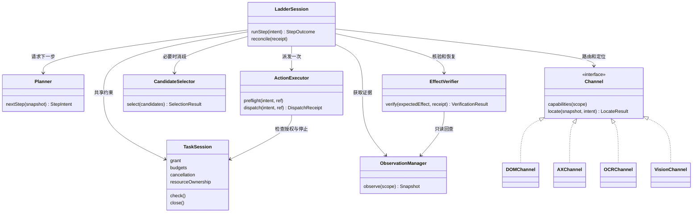
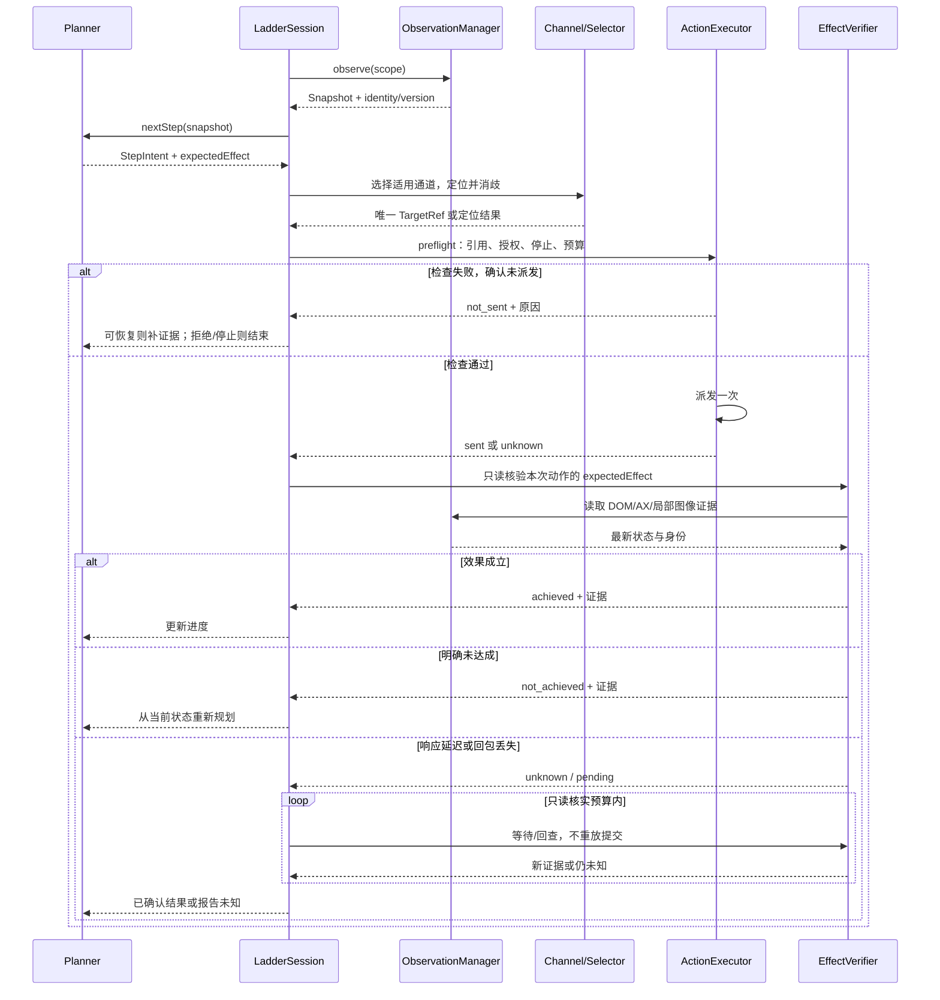
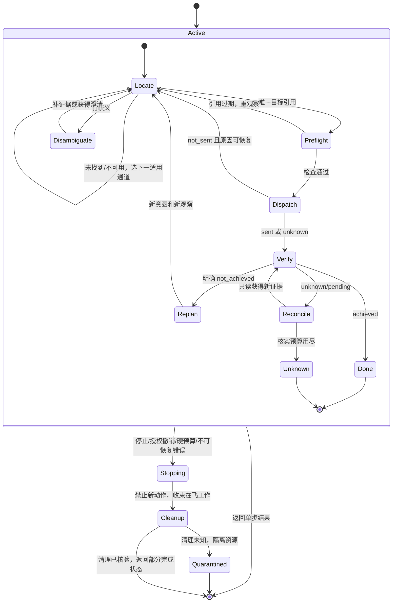

> 状态：进行中（2026-09-26 修订设计与实施方案；S0–S6 尚未开工）。
> 本文描述目标设计，不代表已实现。生产默认 agent 全程不变；新能力显式 opt-in。

# 计划：computer-use 策略阶梯与决策层（S0–S6）

## 1. 目标、依据与本次修订

目标是让每一步选择适合当前应用和动作的执行通道，用可绑定、可复核的目标引用
减少坐标猜测，并以实际效果决定下一步。基本回路为：
**观察 → 规划下一步 → 选择通道 → 定位/消歧 → 执行前检查 → 派发 → 效果核验**。
DOM、AX、OCR、视觉是能力集合，不是每一步都必须走完的四级流水线。

依据：[调研](../../research/computer-use-strategy-ladder.md)、
[现行设计](../../design/computer-use.md)、
[M8 收口报告](../../../backend/benchmarks/computer_use/reports/20260925-m8-closeout/README.md)。
M8 证明定位、选择、规划和预算都可能成为瓶颈；强模型修好合成图坐标，不等于
真实任务就会完成。因此目标同时考察任务成功、误操作、等待时间与实际成本。

2026-09-26 讨论后的修订重点：

- 从固定降级链改为能力与动作驱动的路由；明确歧义、过期引用和未知副作用的不同处理。
- 将定位、派发、核验拆开，DOM 元素操作也受统一授权、停止和预算约束。
- 将文本观察与本地截图、模型图像输入分开，验证真实 SDK 请求中的图像与历史。
- 先交付规则、AX 改进、单一 OCR 和单一浏览器执行路径；D2 模型实验按证据触发。
- 增加视觉专用阶梯对照臂、独立评分和先冻结的采用条件；本计划只给采用建议，不切生产默认。

**范围与既有资产**：复用 M2 frame/image 映射、M7 AX、GroundingAdapter、
SubAgentContext、停止清理框架及 SpendLedger；本计划由用户直接立项，已收编
[backlog](../../backlog.md) 的 OCR/编号预检和 AX 选择复验两项。
沿用已落地的多显示器元数据与边界：M2 窗口须完整位于一台活跃显示器，
不能倒退为主屏假设；AX 副屏效果仍需另行验收，不能从几何支持推定。

**非目标**：N2/SDK 路径、Linux、Safari safaridriver、任意浏览器 profile 接管、
新增业务 API/CLI 集成、原生 computer 协议/UI-TARS、通用历史压缩、动态几何高频压测。
新阶梯自身的引用过期拒绝和图像历史策略属于本计划，不能以这些非目标为由省略。

## 2. 目标架构与职责（UML 类图）

下列名称表达逻辑职责，不要求一一新建类。`LadderSession` 对应前述静态类图中的
`StepController`。优先复用现有 runner、LLMAgent 与会话上下文；不要为 D1–D5
提前建立通用决策框架。



静态速览：[类图 PNG](../../assets/computer-use-strategy-ladder/01-class-diagram.png)
· [SVG](../../assets/computer-use-strategy-ladder/01-class-diagram.svg)。
PNG 可用 macOS「预览」打开，SVG 可用浏览器打开；不依赖 Canvas。

### 2.1 数据契约

- `StepIntent`：宿主分配的稳定 `action_step_id`、动作类型、目标描述、作用域、参数、
  预期效果和任务约束。规划器提出意图；模型生成的坐标或候选编号不能直接绕过宿主执行。
- `Snapshot`：观察 id、会话、应用/窗口/page 身份、版本/导航代次、时间、作用域、
  完整性/截断标志，以及文本、可选图像和显示器/crop 元数据。不同通道不假设有同一个时刻的全知快照。
- `Candidate`：宿主生成的稳定 id、角色/名称/值、祖先与上下文、来源、目标引用、
  可执行性证据。展示行号只用于阅读，不作为目标身份。
- `TargetRef` 是带类型的联合：`DomRef` 保留 context/page/frame 身份与可重解析 locator；
  `AXRef` 保留应用/窗口和原生元素绑定；`ImagePointRef` 保留 session/frame、crop、
  display 和图像点。不要把三者统一压成一个 `(x, y)`。
- `LocateResult`：`found | not_found | ambiguous | unavailable | stale | error`。
  `SelectionResult`：候选 id、`none` 或 `ambiguous`；保留候选集范围/完整性及模型来源。
- `DispatchReceipt`：`not_sent | sent | unknown`，包含实际执行的动作、回执与证据。
  只有能证明零副作用时才可报 `not_sent`；网络超时通常不能证明。
- `VerificationResult`：`achieved | not_achieved | unknown`，附证据及待完成原因。
  `not_achieved` 要有明确证据；页面暂未更新、等待响应应为 `unknown/pending`。

### 2.2 候选选择与引用有效性

先在**原始、已声明的作用域**检查同名候选和截断情况，再排序生成 shortlist。
top-k 里只有一个匹配，不代表原作用域唯一。确定性直取须同时满足名称/角色/
上下文约束和足够的完整性；否则扩大局部观察或消歧。

规则优先，模型只在规则无法决断且有实验价值时参与 D2。模型返回的 id 必须属于
本次候选集；允许 `none/ambiguous`，拒绝越界、幻造 id 和旧观察的结果。
AX 控件与其 OCR 文本即使高度重叠，也可能是父子关系；首期分别保留来源，
不做仅凭 IoU 的融合去重。

派发前再次核验：DOM 重解析并检查 actionability；AX 刷新绑定、关键属性与可执行性；
图像点检查 M2 几何并在观察变化、遮挡或目标局部证据不足时重截/重定位。
几何有效不等于目标仍在原处，也不能用整屏像素完全相等代替局部有效性判断。
检查与派发间仍有竞态，必须保留效果核验与未知结果分支，不能承诺零误点。

### 2.3 观察、反馈与图片历史

DOM/AX 优先给规划器角色、名称、值、祖先、焦点与变化摘要；OCR 使用本地图像，
只有视觉定位/视觉核验需要时才提交所需范围的图像。**本地留档截图不等于上传模型**。

阶梯工具反馈须显式支持文本结果，不能原样沿用 `LocateSession.feedback()` 的
固定 ImageBlock。阶梯会话采用版本化观察：不把过期截图作为默认历史反复发送，
保留动作、结果和可追溯的观察 id；确需旧图时显式引用并计费。
在 SDK 序列化/HTTP 层断言本步及后续文本步骤的真实图像内容与历史策略。
通用子代理压缩另列 backlog，基线 A 的提示、工具反馈和历史不变。

### 2.4 模块与 opt-in 配置

建议最小改动落点（以 S0 接缝测试为准）：

- `tools/computer_ladder.py`：LadderSession、规则路由、状态和共享步预算；
- `tools/computer_dom.py`：Tank 管理的 Chromium 会话、语义定位/动作/只读回查；
- `tools/computer_ocr.py`：单一 Vision OCR 后端与文本候选；
- 现有 `computer_ax.py`、`computer_frame.py`、runner、definition 与消息构造接缝；
- 仅 S4 触发后增加 D2 selector/provider 模块及 hosted 计费适配。

配置草案（S0 冻结 schema 后才视作可用配置）：

```yaml
grounding:
  mode: ladder
  ladder:
    channels: [dom, ax, ocr, vision] # 允许集；实际顺序由能力与动作决定
    selector:
      provider: rules              # 默认无需 profile；S4 才扩展 hosted/local
```

hosted selector 必须显式配置合法 profile、固定模型版本和数据外发范围，默认关闭。
DOM/OCR 可选依赖惰性加载，缺失时返回 `unavailable`，不阻止 backend 启动。
配置校验按启用通道检查工具/依赖，不能因为允许 vision 就声称运行时一定可用。

## 3. 不同情境下的行动决策

### 3.1 路由规则

1. **Tank 管理的 Chromium 页面**：身份已绑定，DOM 能表达动作时先走 DOM。
   首期只用 Playwright `locator.click/fill` 等语义动作，复用其唯一性和 actionability 检查；
   不同时引入原始 CDP Input 与 Quartz 两条浏览器点击路径。
2. **用户当前已登录浏览器**：没有已授权、可绑定的 DOM 连接时，继续在该窗口用
   AX/OCR/视觉。不能悄悄换成空登录态的新 profile；只有任务需要迁移状态时再澄清。
3. **原生应用且 AX 有目标**：按角色、名称、祖先和焦点规则选择；多义先补证据。
4. **自绘文字控件、AX 缺失**：本地 OCR 提供候选；文字存在不代表它就是可点击控件，
   须结合目标区域、上下文及可执行性。已知孤立数字识别失败必须进入 golden set。
5. **无文字图标、图形/空间操作**：可直接进入视觉，跳过明显无助的 DOM/AX/OCR。
6. **已确认焦点的输入/已知快捷键**：复用键盘工具，检查作用域与焦点并读回结果，
   无需虚构定位点击。焦点不明时先观察。
7. **无可用通道或预算不足**：结束并报告已完成、未完成和原因；视觉也可能因截图权限、
   provider 或预算而不可用，不存在“L4 永远可用”的保证。

能力缓存按应用/窗口/page 与版本绑定；导航、窗口切换、权限和连接变化触发失效。
不要每一步重新探测所有通道，也不要沿用已失效的能力信息。

### 3.2 恢复规则（比通道优先级更重要）

- `not_found/unavailable` 且尚未派发：在同一步预算内选择下一个适用通道。
- `ambiguous`：补祖先、邻近文本、局部图像等证据重新判定。换通道可用于消歧，
  但不能丢掉先前歧义直到某一层碰巧给出一个答案。只有缺少用户意图时才询问。
- 派发前 `stale`：重新观察并解析原目标；旧模型结果不能继续使用。
- `not_sent`：按原因修复/重定位；策略拒绝、停止、硬预算耗尽直接结束，不能靠换通道绕开。
- `sent` 且结果待完成：有限等待与只读回查；提交类操作不得因为页面慢就重新点击。
- 派发 `unknown` 或效果未知：只读协调实际状态，能关联到本次动作的证据才算完成；
  无法核实时报告未知。只有证明未派发，或有经过验证的幂等/去重条件，才考虑受控重试。
- 明确效果未达成：回规划器生成修正动作；不能把“暂时没看到变化”当作没有副作用。
- batch 部分成功：返回逐项回执，从实际状态继续；不可整批重放。

### 3.3 UML 时序图：一次提交与回包丢失



静态速览：[时序图 PNG](../../assets/computer-use-strategy-ladder/02-sequence-diagram.png)
· [SVG](../../assets/computer-use-strategy-ladder/02-sequence-diagram.svg)。

### 3.4 UML 状态图：单步恢复边界



所有自环共享任务与动作步预算；重新规划同一未完成动作也保留原步关联与恢复计数，
不能靠生成新 id 重置预算。图中的终点表示单步返回；未知结果未协调清楚时不得继续
依赖该结果的动作。任务结束仍统一经过 TaskSession 清理流程。
静态速览：[状态图 PNG](../../assets/computer-use-strategy-ladder/03-state-diagram.png)
· [SVG](../../assets/computer-use-strategy-ladder/03-state-diagram.svg)。

## 4. 决策模型、预算和生命周期

### 4.1 D1–D5 的边界

- **D1 通道选择**：先用能力/动作规则；不默认每步调用模型。
- **D2 候选选择**：首要实验点。先规则与同 shortlist 的生成式小模型对照；确有瓶颈，
  再选 hosted Jev 或一个本地实现。返回稳定 id/none/ambiguous，不输出可直接执行指令。
- **D3 效果核验**：先确定性 DOM/AX/文件等后置条件；模型只解释不确定证据。
  运行时核验与 benchmark 独立 validator 分离，不能用模型自报作为评分真值。
- **D4 恢复/门控**：由结果类型、预算、授权与经校准的信号控制；单个 confidence 不能
  跨通道当成正确率，更不能覆盖歧义、过期引用或未知副作用。
- **D5 batch**：先规则，仅限短、可预测的序列；每项检查、逐项回执，导航/模态变化/
  提交等会改变后续前提的边界拆开。模型 batching 框架延期。

若 S4 选 Jev，按[官方 API](https://docs.typesafe.ai/api) 的
`https://api.typesafe.ai/v1/systemone`、`questions` 映射和 Choice/Score/Noul 实现，
固定模型版本，不依赖社区 wrapper 的 `/api/v1/decisions`。
Noul 没有单独 confidence；Choice 的 confidence 也不是已校准的正确率。
本地复现与官方不视作等价，记录 Mac 实测冷/热启动、内存与延迟。

### 4.2 分层预算与真实记账

预算同时约束任务/trial、动作步与单次操作，不能仅增加 `decision:* call_id`：

1. **任务/trial**：总 deadline、agent/model 请求数、token、可计价费用；规划、定位与
   D2 共同消耗。record-only 价格账本不宣称强制金额封顶，仍须执行请求与时间硬上限。
2. **动作步**：稳定 id 下分别统计通道访问、重观察/重定位、模型调用与等待时间。
   S0 冻结初始上限：每个适用通道首次尝试最多一次（至多四条），额外重定位合计最多
   两次，而非每层两次；含额外尝试最多六次定位调用，且仍受任务/单步 deadline 限制。
   旧模式“一次后备切换”与四通道路由不是相同计数，不机械复用旧计数器。
3. **单次操作**：DOM/AX/OCR/模型超时及取消传播；局部 CPU 推理计时和资源限制。
   重截图、换通道和工具调用返回不能重置前两层预算。具体时间/请求/费用配置在批次前冻结。

hosted 决策不是现有 Chat Completions HTTP 形态：现有 `SpendSession` 的请求
allowlist、`prompt_tokens/completion_tokens` 解析不能直接复用为完成证明。
S4 必须增加 provider 适配，覆盖 `input_tokens/output_tokens`、请求前 reserve、
响应 settle、unknown 保留 reservation/停批、单次计费与 SDK 自动重试关闭。
选择结果完成结算/校验前不得进入动作执行。本地模型不伪造 hosted token/费用。

每次尝试记录 task/trial、action_step、attempt/call id、观察版本、候选作用域与截断、
通道及选择原因、定位结果、派发状态、核验证据、各阶段耗时、图片/请求/token/费用和
剩余预算。事件按这些 id 关联，业务敏感文本按留存策略处理；不能只存一个笼统的
“fallback failed”而丢失已发生的动作。

### 4.3 授权、停止、清理与回退

DOM 与 Quartz/AX 共享 computer 工具的授权边界、取消与预算，不能有一条“内部直调”
绕开。界面文本同样可能敏感；授权已有模型接收截图不等于授权新增 provider 接收文本。
hosted 外发范围按目的地和数据内容明确；网页/AX/OCR 内容是任务数据，不是新指令或授权。

Tank 管理 Chromium 首期通过自身创建的 browser/context/page 绑定身份，不以相同
title/url 猜测用户窗口。使用隔离 profile，不读用户 cookie/凭据存储。
已有浏览器 CDP 附着后置；若触发，只接显式本地端点并验证目标身份/所有权，
不能把端口可达当作有权控制所有标签页。

停止时拒绝新动作、取消并等待在飞调用收束、释放持有按键/鼠标并核验清理；
取消任务不代表远端 CDP 命令已撤回，迟到回包和副作用必须进入协调流程。
清理无法确认时隔离相关资源，不把不确定会话交给下一任务。
Tank 创建的浏览器按既定保留/关闭策略处理；用户所有实例只断开连接，不擅自关闭。
目标引用、观察缓存与 selector 结果在会话结束时失效。停止与回退不撤销已经发生的业务效果。

回退步骤：结束/清理当前 ladder 会话 → 删除 opt-in 配置 → 创建新的基线会话。
删配置只影响后续会话，不会中断在飞动作。本计划不改生产默认，也不把 S6 解释为部署授权。

## 5. 实施阶段与退出条件

按阶段先测试后实现、完成即提交。离线完成与 live 验收分开记录；任何已授权范围内的
常规开发无需重复确认，付费/真实桌面实验沿用既有逐批授权纪律。

### S0：冻结契约与最小闭环（离线）

- 冻结 StepIntent、Snapshot、typed ref、定位/派发/核验结果、事件 schema、规则真值表、
  配置与共享预算。采用现有 runner 接口，避免先写通用 DecisionProvider 家族。
- 用 fake OS/provider 打通“观察→规划→定位→统一派发→核验”的 SDK 消息链；
  验证纯文本反馈、旧图像历史策略、停止传递和基线 A 不受影响。
- **退出条件**：所有副作用分支有契约测试，真实序列化请求与事件可审计；
  `unknown` 不重放、策略拒绝零派发、计数不重置均通过。

### S1：AX 候选改进与一个 OCR 预检（离线）

- 扩展 AX 稳定 id、祖先/焦点/值、完整性与作用域；先检测歧义再排序，保留原生引用。
- 首期只实现 macOS Vision OCR（pyobjc 惰性加载），使用现有 frame/display/crop 转换。
  不承诺零依赖，不同时上 RapidOCR，也不提前融合 AX/OCR。
- 冻结含中文、密集小字、孤立数字、重复标签、父子文本、图标与无目标样本的 golden set；
  按帧/布局划分训练校准与 holdout，避免相似截图泄漏。
- **退出条件**：候选召回、误匹配、歧义拒绝、top-k 保留率及定位误差有离线报告。
  预先冻结的阈值未过则 OCR 保留辅助/禁用，记录原因，不阻塞其它通道。

### S2：Tank 管理的 Chromium 语义路径（本地集成）

- 一个 Playwright 管理实例、一条 locator 动作路径；准确绑定 page/frame/导航代次。
  文本观察、点击、填写与后置条件读回组成闭环，不依赖 Quartz 窗口标题映射。
- 使用确定性本地页面覆盖重渲染、重复文本、遮挡、禁用、导航与 iframe。
  iframe 必须显式绑定作用域；无法确认目标/允许范围的 frame 返回不可用或歧义。
- **退出条件**：本地浏览器集成通过、默认 backend 无 extras 仍可启动，
  权限/取消/预算在真实 Playwright 调用之前生效。无用户日常 profile 访问。

### S3：规则阶梯与停止恢复闭环

- 接入能力缓存、规则路由、typed refs、派发回执、只读协调及逐项 batch 回执。
- L4 用 GroundingAdapter 风格的定位能力接入同一步；生产 A 的完整一体 agent 是
  独立基线，不能充当一个可嵌套定位器。需要重新规划时显式回到 Planner。
- 先 fake provider + 真实 SDK 序列化 + fake OS 全链路，再授权小规模桌面 pilot。
  验证视觉专用阶梯 V，为 S5 分离新框架开销建立对照。
- **退出条件**：缺通道、歧义、超时/迟到回包、未知效果、部分成功、用户停止和清理失败
  全部有确定行为；开发服务与既有 E2E 回归通过。

### S4：按瓶颈触发 D2 模型实验

- 仅当 S1–S3 表明候选已包含目标、规则选择仍限制效果时启动。否则记录未触发并继续 S5。
- 固定同一 shortlist、目标与观察，比较规则、生成式小模型，再选 hosted Jev 或一个本地
  selector；不把两个 provider 和 D1–D5 全量建模当作必交付。
- 数据划分按应用/布局族留出；测正确选择、危险误选、none/ambiguous、拒绝率、
  风险随阈值变化及端到端时间。若配置强规划器恢复，也计入共享预算并单独记录。
- hosted 先 fake HTTP 验证协议与记账，再经数据范围/预算授权运行付费回放；
  付费离线回放也是付费实验，不能写成“S0–S4 API 费用为零”。
- **退出条件**：同候选集优势和错误代价有证据；无优势则保留规则并记录淘汰，
  不把接入新模型本身视为成功。

### S5：配对实测、消融与采用证据

- 保留原任务集做回归；新增 Chromium suite revision 做浏览器评估。
  原 03-browser-navigate 指定 Safari，10-links-history 有 Safari 清理假设，
  不可拿旧 Safari 成绩直接比较新 Chromium。新 revision 的所有臂共享应用、页面、
  初始状态、模型参数、评分与资源限制。
- 臂：A＝冻结生产基线；V＝新阶梯框架仅视觉；L＝完整规则阶梯；L+D＝只替换 D2。
  V 的观察/历史策略独立冻结。A vs L 是系统比较；A vs V 测框架、规划/定位拆分和
  反馈策略这组差异的总体影响，不能单独归因于其中一项。V vs L 测
  结构化通道增益，L vs L+D 测选择器增益。按失败假设做必要消融，不铺全因子矩阵。
- 每任务 n≥3 只作为 pilot；确认性实验的任务族、重复数、误差/置信区间方法、
  最小实际改进与失败/成本容忍界限先冻结，不能看完结果再定“严格优于”。
  配对轮转先手，按任务/布局相关性报告区间；样本不足的 p95 只作描述并列 N。
- 报告独立 strict/partial 成功、危险误操作/歧义拒绝、输入语义、清理、总 wall 及
  各阶段延迟、真实请求/图像/token/可计价费用。失败/unknown/清理异常全部进入分母。
  不能用 token 单独推断不同 provider 的货币成本；未计价部分显式列出。
- **退出条件**：完整冻结链、独立 validator 和原始证据可复核，能够逐场景决定
  保留 A、试用 L、试用 L+D 或继续研究，而非一次性强制全局采用。

### S6：采用建议与关档

- 依据预先冻结条件给分场景建议，列明适用应用、动作类型、效果/时间/费用边界与反例。
  默认不切换；若将来接受采用建议，另立可审查的生产切换变更。
- 已实现且验收的行为才写入 [现行设计](../../design/computer-use.md)；
  未通过的模型/通道只留研究记录，不能写成现行能力。
- 全部阶段完成或明确丢弃后更新状态，计划移到 done/，同步索引及反向链接；
  条件性未做事项带触发条件移交 backlog。

## 6. Tests

复用 `backend/core/tests/` 现有相关测试文件；新模块有实质行为才建对应测试，
不为文档声明或一对一实现细节写形式测试。

- **契约/消息链**：typed ref 身份、跨会话/旧观察拒绝；规划器只接受结构化结果；
  文本步骤真实 SDK 请求无意外图像、历史不反复带旧图；基线 A 回归不改预期。
- **AX/OCR**：原作用域重复而 top-k 唯一、截断、父子重叠、无目标、中文/孤立数字、
  焦点变化、稳定 id 与索引不同；golden set 按预先冻结指标验收。
- **DOM**：同 URL 多标签页身份、重渲染/导航旧引用、overlay/disabled、iframe 范围；
  点击/填写/读回；无额外依赖启动；不可达/失去连接零误附着。
- **路由/恢复**：所有 LocateResult、已发送回包丢失、延迟页面更新、明确未派发、
  旧候选迟到、部分 batch 成功；断言无重复提交、无歧义绕过、无无限降级。
- **预算/provider**：跨观察/换通道预算守恒，真实 HTTP 请求 reserve/settle 一次，
  usage unknown 保留预留并停批、重试关闭，模型答案结算前不派发。
- **授权/生命周期**：拒绝/撤销/取消前后、超时后迟到 CDP 副作用、持键释放、资源归属、
  清理未知隔离；网页恶意指令不得改变授权或 provider 数据范围。
- **集成/E2E**：专用 Chromium job 安装 extras/browser 且相关测试必须实际运行；
  普通无 extras 环境可显式 skip，但不能拿它替代 S2 验收。扩展现有
  [chat.feature](../../../test/features/chat.feature) 覆盖 ladder 配置/消息回传与停止，
  使用受控页面和 fake 模型，不依赖私人桌面或付费 API；真实 OS 效果另由授权 pilot 验证。

## 7. 实验边界与延期事项

S0–S2 用离线 fixture/fake provider/本地浏览器；S3 先离线，再按需 live pilot；
S4 的 hosted 回放及 S5 live 都须列清数据目的地、模型版本、请求/时间/费用上限。
沿用批次材料冻结 → 用户逐批授权（含 initial 状态）→ 串行执行 → 零自动重试 →
独立评分与报告归档。此纪律适用于实验，不意味着给常规已授权可逆动作新增确认弹窗。

本次修订只更新设计、计划和配套图片，不执行桌面实验、不调用付费 selector。

延期项及触发条件（关档时移交 backlog）：

- RapidOCR：Vision 在冻结样本上失败且第二后端有可验证改善时再比较。
- AX/OCR 融合：两源确有互补收益、能保持父子语义与 provenance 后再做。
- 已有浏览器 CDP 附着/登录态：明确用户任务依赖且具备授权连接和身份绑定方案时启动。
- D1/D3/D4/D5 模型化：规则有已归因瓶颈且潜在收益覆盖新增调用时另做单变量实验。
- 其它既有非目标维持 backlog 原条件，不因本计划讨论过就默认为已授权实现。

## 8. 验证清单（最终步骤）

每个代码阶段按改动执行全部适用项；失败均修复后再宣告完成。仓库拆包后 Python
代码位于 `backend/core` 等目录，命令路径须覆盖实际改动，不能检查不存在的旧目录。

1. `cd web && pnpm lint`
2. `cd web && npx tsc -b --noEmit`
3. `cd backend && uv run ruff check core/src/ core/tests/`；涉及其它 backend 包时补其路径。
4. `cd backend && uv run pytest`
5. `cd backend && uv run pyright <改动的 Python 文件>`；不得以 `# type: ignore` 掩盖错误。
6. `cd cli && uv run ruff check src/ tests/`
7. 开发服务日志：`tmux capture-pane -t tank -p -S -50 | grep -i "error\|traceback\|exception"`；
   空输出通过，不重试；有错先修复。
8. `cd test && pnpm test`；backend/frontend 必须运行。
9. `python3 scripts/check_docs.py`
10. `python3 scripts/check_protocol_sync.py`；改动协议或生成产物时必须执行。

仅改 `docs/` 的本次修订按仓库例外只执行第 9 项；另做 diff 空白/链接/图像可读性检查。
