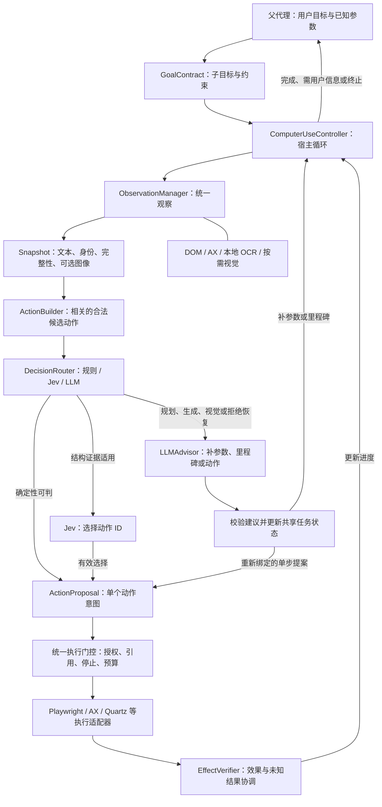
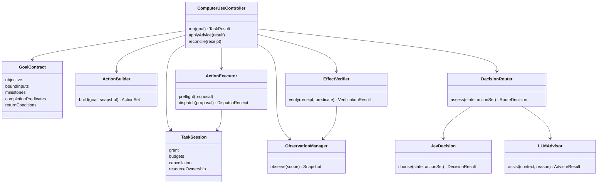
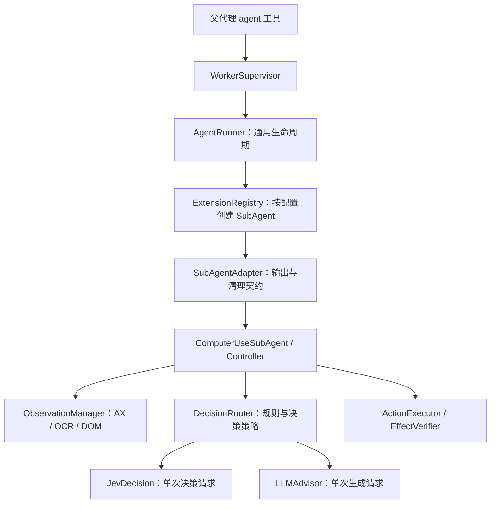
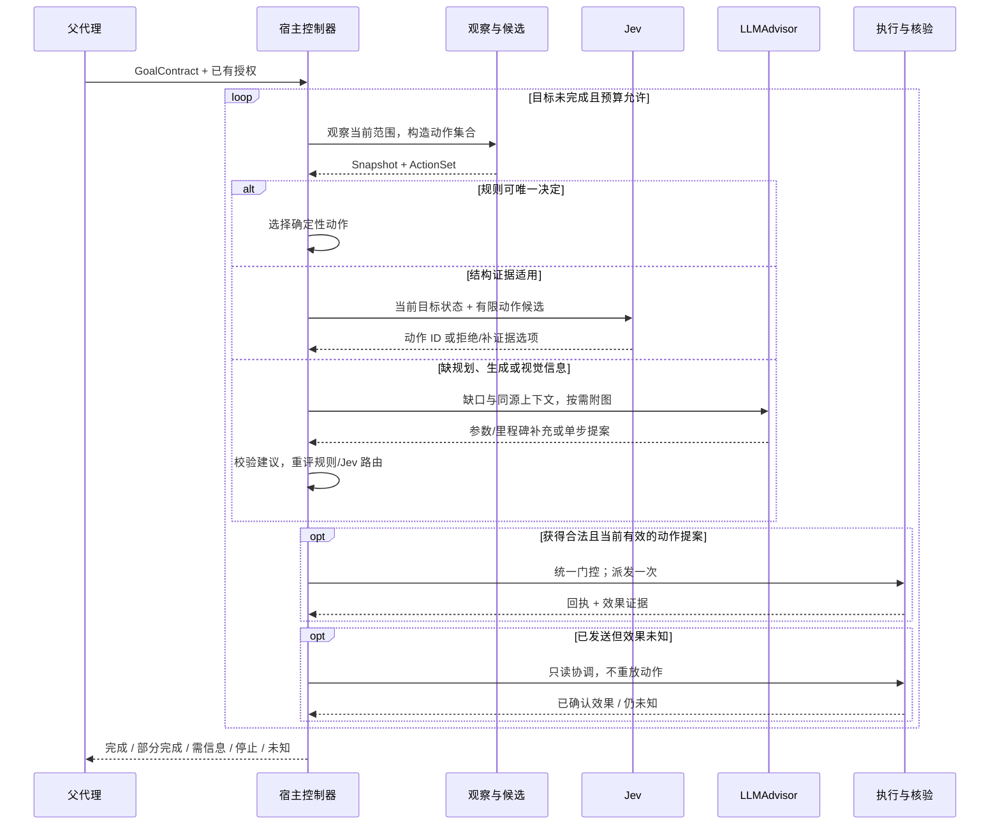
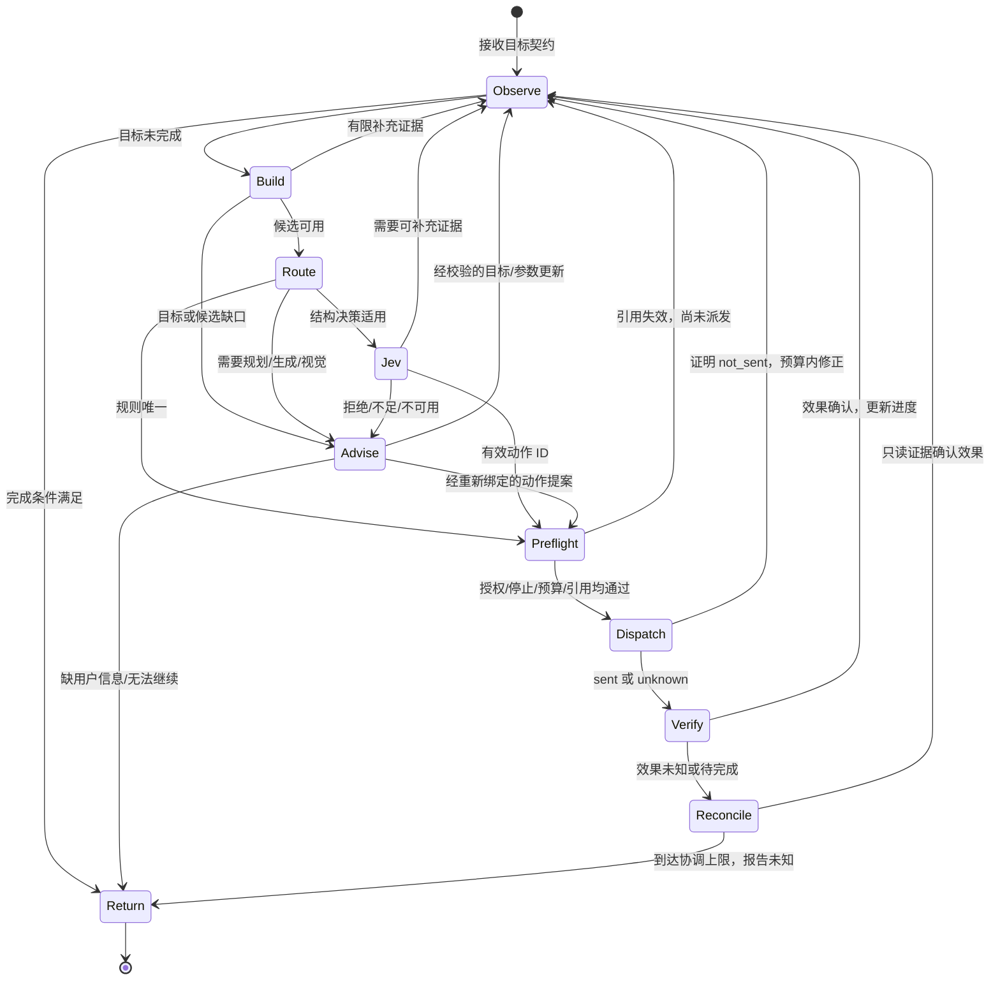

> 状态：进行中（2026-09-29：S0 前七批基础切片已通过回归与评审；第七批完成 Supervisor extension 受控出口的必需持久审计；legacy 出口迁移、G1/G2 完整接线、真实通道与恢复仍待实现）。
> 完整目标设计尚未实现、尚未实机验收。生产默认与基线 A 不变，新子代理显式 opt-in。

# 计划：Computer Use 子代理的宿主循环与策略阶梯（S0–S6）

## 1. 目标、范围与本次决策

目标是在不降低任务完成和执行可靠性的前提下，减少界面操作中的主 LLM 往返、
图像上传与总等待时间。采用 **宿主驱动循环：规则直接处理确定性步骤，适用的
结构化决策优先 Jev，需要规划、生成或视觉理解时调用 LLM，补齐信息后重新评估并回到快速路径**。

两条选择轴分开设计：

- **谁作决策**：规则 / Jev / LLM；LLM 不再默认每步规划，Jev 不再仅是 D2 控件选择器。
- **如何观察和操作**：Playwright/DOM、macOS AX（即 Accessibility）、OCR、视觉。
  LLM 也可以只读 DOM 文本；Jev 也可以选择 OCR 候选。不能把 LLM 等同于截图点击。

“结构信息足够”指当前目标和决策所需证据足够，不是有一棵 AX/DOM 树就放行。
Jev 负责选择，宿主负责授权、动作构造、状态、派发和完成核验。
目标是成功任务的端到端效率，不是最大化 Jev 使用率。

本次取代 2026-09-26 版“LLM 每步提出 StepIntent、Jev 仅条件性 D2 实验”的目标架构；
D2 回放仍作为阶段验收，但不再是最终范围上限。S0 起即建立目标级宿主循环，
S3 接入 Jev，S4 验证多步目标和 LLM 介入后继续执行，S5 再评价采用收益。
同日边界复核进一步采用现有通用 SubAgent extension 入口：ladder 是 Computer Use
内部策略，不再给 AgentRunner / GroundingConfig 新增 ladder 专用分支。
2026-09-29 补充：插件暂按可信进程内 Python 代码处理。Computer Use 插件交付必须同时
完成 §2.6 的核心统一治理及跨插件验收；不能仅靠插件自觉调用 check/上报 usage 宣告接线完成。
本次只修订设计和验收，不把目标架构描述成已实现的现行能力。

依据：[调研](../../research/computer-use-strategy-ladder.md)、
[现行设计](../../design/computer-use.md)、
[M8 收口](../../../backend/benchmarks/computer_use/reports/20260925-m8-closeout/README.md)。
M8 的真实任务失败还涉及规划、流程和预算，不能把定位正确率当作任务成功率。
本文件包含未来设计和实施计划；现行设计文档只在能力实际落地后更新。

**复用资产**：M2 frame/image 与显示器映射、M7 AX、GroundingAdapter、AgentRunner、
SubAgentContext、执行白名单、审批、停止清理、SpendLedger 与独立 benchmark。
本计划已收编 [backlog](../../backlog.md) 的 OCR/编号预检、AX 选择复验。
保留已落地的多显示器身份与 crop 语义；M2 窗口完整位于一台活跃显示器，
AX 副屏效果仍需单列验收，不从几何支持推定。

**非目标**：N2/SDK 供应商算法及业务行为重写（公共治理接线属于本计划）、Linux 实机支持、
不可信插件的 OS 沙箱/进程隔离、Safari safaridriver、任意用户 profile 接管、
新增业务 API/CLI、原生 computer 协议/UI-TARS、通用历史压缩、动态几何高频压测。
当前范围内的引用过期、图像历史、焦点与迟到回包处理不能因此省略。

## 2. 界面操作架构

### 2.1 父代理、子代理、模型与执行器

父代理理解用户任务并通过既有 agent 委派入口交付目标。Computer Use 子代理由
`ComputerUseController` 持有循环，不把长时运行交给一个无限的 LLM tool loop。
名字表示职责，不能据类图机械地一类建一个文件。



静态总览：[架构 PNG](../../assets/computer-use-strategy-ladder/04-architecture-diagram.png)
· [SVG](../../assets/computer-use-strategy-ladder/04-architecture-diagram.svg)。
PNG 可用 macOS「预览」打开，SVG 可用浏览器打开，不依赖 Canvas。

### 2.2 UML 类图：逻辑职责



[类图 PNG](../../assets/computer-use-strategy-ladder/01-class-diagram.png)
· [SVG](../../assets/computer-use-strategy-ladder/01-class-diagram.svg)。
图中的具体名称说明运行时协作，不要求 Controller/Router 导入这些具体类；
静态依赖及装配边界以 §2.5–2.6 为准；TaskSession 只引用核心持有的运行状态。

### 2.3 现有代码接缝与模块边界

现有 `LLMAgent._get_tools()` 与 `AllowlistExecutor` 已把“提供给模型的工具”
和“允许执行的工具”对齐，但列表在一次 run 开始时生成，并非逐界面动态重建。
现有 grounding 分支围绕 screenshot/locate/reference action；这些不是新循环已经实现的证据。

**采用已有 `extension → SubAgentAdapter → SubAgent` 接缝**，不新增
`if grounding.mode == "ladder"`。现有实现见
[Runner](../../../backend/core/src/tank_backend/agents/runner.py)、
[SubAgent 契约](../../../backend/core/src/tank_backend/agents/subagent.py)、
[适配器](../../../backend/core/src/tank_backend/agents/subagent_adapter.py)。
Runner 负责通用工厂、任务上下文、权限、桌面锁、取消、输出和清理；
Computer Use 内部负责通道、规则/Jev/LLM 路由、候选和核验。
Runner 可识别 desktop 等能力声明，但不识别 ladder 算法、Jev 或 OCR。

S0 第二批已新增 `backend/plugins/agent-computer-use/`，manifest type 为 `subagent`；
`ComputerUseSubAgent` 实现 `run(request, context)` / `aclose()`，
内部组合 `ComputerUseController`；目前只有离线骨架，默认工厂无真实通道。
这是 Tank 进程内的领域实现，不要求另启进程或增加一次 LLM 请求。
生产默认及 split/ax/integrated、N2/SDK 的领域行为保持原路径；公共治理按 §2.6 兼容接入，
不复制旧的政策实现。冻结的实验基线 A 保留原 revision，不用新运行时冒充原基线。



插件内部按职责组织：`agent.py` 对接 SubAgent；`controller.py` 持有目标循环；
`observation.py`、`action_builder.py`、`decision_router.py`、`executor.py`、
`verifier.py` 提供领域服务；`jev_decision.py` 和 `llm_advisor.py` 适配模型；
`contracts.py` 放小型数据契约；`channels/` 放新 DOM/OCR 适配器。
这里只确定职责边界，按实际规模拆文件，不先造通用 D1–D5 框架。
取消此前 `tools/computer_ladder.py` 作为混合入口的落点：策略控制器不继承 BaseTool，
不注册成 LLM 工具；只有需要复用 ToolManager 时才增加薄工具适配层。

**复用有边界**：直接复用现有 AX 枚举/刷新/派发、frame/坐标和 GroundingAdapter 能力；
不整段复用 AXSession 的“枚举后调用 LLM 选编号”，也不沿用总附图的 feedback。
Advisor 复用 `LLM.complete_response(tools=..., retry=False)`，保留严格解析、
当前图像装填与共享记账；不复制 `chat_stream`，不嵌套一个自动执行工具的 LLMAgent。

现有 extension 工厂只接收 `factory(config)`，不会自动注入核心 ToolManager、
命名 LLM profile 或其白名单。目标设计保留工厂校验私有配置及选择协议/通道适配器；
资源创建、凭据解析、模型发送及动作派发必须在运行时经 §2.6 的任务服务完成。
工厂/import 不启动模型请求、浏览器、桌面输入或其它任务副作用。插件仍提供领域适配器，
但不再创建绕过核心治理的独立调用链，也不获取完整 AppConfig/ToolManager 服务定位器。
SubAgentContext 是运行时注入入口，插件按构造参数只向内部组件传入其需要的小型接口。

核心层可能需要修改，但只修改通用契约：

以下输入、上下文和结果外壳已在 S0 首批实现（见 §8 实施记录）；插件恢复仍待实现。

- 通过通用 request.context 传递组装后的任务约束/工作区指令；S0 首批已补齐此前
  extension 分支只传 agent_def.system_prompt 的缺口。
- 父代理的可选结构化任务输入通过 `agent.task_input → SubAgentRequest` 传递；
  核心只校验通用类型/大小、保存并绑定审批，Computer Use 校验 GoalContract 内容。
  不要求通用 AgentTool / Runner 理解 PDF 导出、候选或里程碑。
- Adapter / Supervisor 接收通用任务结果与停止原因，区分执行结束和目标完成。
  旧 extension 的 `final_answer` 契约保留，新增版本化 TaskResult 接受 partial/unknown/needs_input，
  不能伪装成 final_answer，或仅因流结束就报告成功；已有插件契约保持兼容。
- 如支持补用户信息后继续，核心保存通用任务记录、累计预算和授权引用，插件保存并解释
  自己的版本化进度；恢复后由插件重新观察并绑定控件。
  不能只追加聊天消息重新运行。首期不承诺跨进程恢复，不保存并重用原生 AX 句柄。

Brain 只接通用委派与结果通知。若启用“GUI 统一委派”策略，按 computer 工具类别限制
主代理的直接调用；不把 Jev/AX 路由写进 Brain，语音回复打断与后台任务停止保持区分。

### 2.4 JevDecision：有预算的单次决策适配

`jev_decision.py` 提供 `choose(goal_state, snapshot, action_set) → DecisionResult`；
一次 choose 在通过前置校验后最多发送一次 Jev API 请求，拒绝/预算不足时可以零请求。
它没有 observe-act 循环，也不执行 UI、拆目标或自行改用 LLM。

一次调用的协作顺序（公共治理由核心执行，Jev 适配器只构造/解析协议）：

1. 校验输入版本/候选 ID，取已获准外发的有界状态视图，构造 state/questions，
   显式加入 none/ambiguous/need_more_context/escalate 控制选项。
2. 向核心受控模型服务提交请求；核心生成唯一 request id，检查授权/期限/取消及共享额度，
   预留后发送一次请求。客户端连接由核心管理，SDK/HTTP 隐式重试关闭。
3. 适配器校验真实 usage 和决策回复，核心结算用量；即使决策格式无效也必须结算已知用量。
   答案属于本次候选/控制选项且结算成功后，才返回可供控制器使用的决策及原目标/观察/候选版本。
4. 对无效响应、不可用或未知用量返回明确错误/受控停止；不伪造模型的 ambiguous。

`DecisionRouter` 判断是否适合调用及如何处理决策结果；Jev 原始统计字段只在适配层解析，
由插件装配的校准策略生成带原因的接受/拒绝结果，不在 Router 中写供应商字段分支。
`ComputerUseController` 决定补观察、升级或终止；
`ActionExecutor` 在最终派发前再次验证状态和授权。
Jev 的领域 payload 与协议解析首期可放在同一小模块；HTTP 发送、连接所有权及治理复用
核心服务，不另建插件私有客户端生命周期。

### 2.5 依赖方向复核：抽象与具体实现

前版 Runner 新增 ladder 分支属于领域职责泄漏；具体表现是高层生命周期依赖具体策略
（DIP 问题），并让扩展策略反复修改 Runner（OCP 风险）。OCP 针对预期变化轴，
不是禁止修改任何代码；实现类、协议适配器和插件装配工厂知道具体实现是正常的。
本计划只隔离已确定的变化轴，不引入统一所有模型/通道的框架。

以下是设计歧义及接入缺口，不是宣称尚未实现的新模块已经存在代码缺陷：

1. **Router 与模型实现**：Router 依赖小型结构化选择契约 `choose(...) → DecisionResult`；
   Advisor 保留独立 `assist(...) → AdvisorResult` 契约。JevDecision 与测试 fake 实现前者，
   LLMAdvisor 实现后者；插件工厂选择并注入实现，不由 Controller/Runner 判断 provider 名称。
   Jev 请求字段、答案解析和供应商错误归适配器；校准策略由工厂注入，按模型/问题/任务族
   校准后给出接受/拒绝及原因，Router 处理这些领域结果。原始分布保留作诊断，不能成为
   高层遍历 `answers.*.confidence` 的依赖；错误、模型弃权和宿主拒绝仍分开记录。
   规则/结构化选择/生成建议的分支本身是领域策略，可以保留。
2. **观察与执行能力**：ObservationManager 调度已注册的观察源，ActionExecutor 调度
   已注册的动作后端；OCR 只实现观察，不强迫它实现无意义的 click。AX/DOM 可同时提供
   两种能力。Controller/ActionBuilder 读语义角色、动作能力、完整性和引用有效性，不读取
   AX 原生属性、Playwright locator 内部字段或 OCR 引擎对象。来源标签和不同 typed refs
   可以保留；仅对应边界适配器解释原生句柄与坐标。首期局部注册映射/构造注入即可，
   不要求通用插件发现框架；新增实现但语义能力不变时不修改控制循环。
3. **任务外壳与领域状态**：AgentTool/Runner/Supervisor 只理解通用输入/结果外壳、
   生命周期和版本化的不透明插件进度；GoalContract、里程碑和界面回执由插件解释。
   图中的 TaskSession 是引用 SubAgentContext 的领域会话，授权、取消、deadline 和
   任务累计账本沿用同一对象，不能另复制一套同作用域计数。恢复时核心恢复通用资源与预算，
   插件恢复领域进度；核心不按 AX/DOM 类型反序列化原生句柄。
4. **核验与业务流程**：ActionBuilder/EffectVerifier 使用有限动作模板及有明确语义的
   predicate evaluator；PDF 导出是目标契约与完成条件的用例，不成为 Controller 内的
   `if app == ...` 流程。确有应用特例时局部实现并装配，不放进通用 Runner 或账本。
   不支持的完成条件返回 unknown/需补充，不能执行 LLM 生成的任意核验代码。
5. **协议与共享治理**：现有 LLM 是 Chat Completions 客户端，见
   [complete_response](../../../backend/core/src/tank_backend/llm/llm.py)；
   Jev 是独立的 state/questions 协议适配器，不继承 LLM，也不在 LLM 中加 Jev 分支。
   两者复用已有任务授权、取消、预算和观察事件契约；共享治理不代表共享请求/响应 schema。
   通用预算接口接收已校验的请求额度与用量，不解析 Jev/ChatCompletion 原始 JSON。
   协议适配器向核心受控调用入口提交请求，核心在真实 transport 边界准入/捕获/结算；
   不能仅靠插件调用后报告 USAGE。具体配置与生命周期见 §2.6。
6. **实验设施与生产依赖**：当前
   [SpendSession](../../../backend/core/src/tank_backend/benchmarks/spend_http.py) 的请求白名单和
   usage 解析绑定 Chat Completions；[driver](../../../backend/core/src/tank_backend/benchmarks/driver.py)
   明确拒绝 extension 的 request_limits，并仅给内建客户端挂 HTTP 捕获；
   [RequestBudget](../../../backend/core/src/tank_backend/benchmarks/request_budget.py) 仅有 planner/locator。
   这些是接入缺口，不能删拒绝条件就声称兼容。实验层通过通用接入契约核验每个客户端
   的请求准入/捕获/结算，具体协议校验由适配器承担，不按新插件名写特殊放行。
   生产插件不反向导入 benchmarks。2026-09-29 用户复核后明确：core 只共享无策略的
   TokenUsageLedger；SpendLedger 的 trial/batch、预留/价格/journal 全部保留在实验层。
   生产默认只统计，显式旧 token_budget 配置兼容；实验策略经可选准入接口注入，
   由同一调用 ID 关联实际用量与实验结算，不重复计数。

更换同契约实现应只影响适配器、插件装配/配置及对应测试；新增业务能力或改变契约时，
修改领域策略是合理的。采用小型 Protocol 或有类型的 callable 验证这些边界，
不要求每个辅助函数都有 ABC，不为尚不存在的供应商预建实现。

### 2.6 可信 agent 插件的核心统一治理（2026-09-29，目标设计）

#### 范围、现状与设计原则

本节约束 Computer Use、现有 `type=subagent` 插件及旧 `type=agent` 插件的公共运行机制。
可信表示插件遵守接口及接入规范；进程内 Python 仍可自行访问系统，能力接口不是安全沙箱。
不引入隔离 worker、RPC、容器或 Python monkey-patch。将来明确接入不可信插件时另立计划，
不能把当前命令执行沙箱或 manifest permissions 宣称为插件隔离。

当前只有通用输入/结果、任务授权、token 累计、停止、桌面锁与清理监督等部分接线；
LLMAgent 内的执行白名单/审批链、SDK 模型调用包装和 benchmark 预留捕获仍分散。
以下是必须实施的收敛，不是当前已具备的能力；S0 前两批仍按原记录计验收。

核心拥有公共规则、状态和机制；插件只提供领域策略、协议解析、原生适配和效果证据。
复用现有 ToolApprovalPolicy、审批执行器、AllowlistExecutor、SubAgentAdapter、WorkerStore
和账本原语，必要时最小提取到核心中立模块。Runner 只装配/管理生命周期，不增长成
认识 Jev、AX、OCR 或应用流程的巨型控制器；生产核心不导入插件包或 benchmarks。
不为每条规则造一个服务，不按供应商重复实现同一检查，也不要求所有能力都包装为 BaseTool。

#### 任务绑定的窄接口与装配

保留 `factory(config)` 与 `run(request, context)` 的外壳。核心在派发批准后创建一个
任务运行时，绑定 task_id、原授权、累计账本、deadline、取消、策略快照和事件关联标识；
通过 SubAgentContext 提供执行、模型调用和事件所需的窄接口，以及资源/恢复生命周期操作。
这些是职责契约，名称和文件数由实现决定；不用任意字符串 `get_service()` 或全局单例。
观察器不能改变执行状态，插件只能读取预算快照、请求受控操作和上报领域事件，不能自行
增加授权、清空账本或覆盖 cleanup=confirmed。旧可写字段通过兼容适配收敛，不能长期保留
两套治理所有者。每个运行时绑定一个任务；切换模型、拆目标或恢复不重新创建总预算。

可信适配器通过类型明确的接口装配进受控服务；插件给出所需能力声明与配置，宿主依据
注册信息和原策略确定有效权限。模型输出和页面数据不能自报 permission 后即获得该权限。
核心持有底层执行入口/transport 的调度权，插件控制器拿到的是受控调用面。
核心 API 能力版本在进入任务、创建资源前校验；不兼容配置明确拒绝，不静默绕开治理。

#### 公共职责及边界

1. **执行与授权**：核心统一执行白名单、审批继承、文件/网络/桌面等策略、参数范围、
   撤权/取消/deadline 和动作次数检查。已有工具走现有执行链；新原生适配器通过同一
   政策源的受控入口接入，不能拿到 desktop 权限便自动获得 shell/filesystem/network。
   插件负责把动作映射成声明的能力与资源目标，并做控件身份/代次等领域 preflight；
   核心在异步 preflight 后、实际派发前再次检查公共条件。只读观察、能力探测和核验读回
   同样经核心检查读取范围、停止与观察配额；不因没有 UI 副作用而绕过授权，插件仅决定
   观察源和解释证据。原生适配器须在最终输入边界
   使用核心提供的检查/派发协作接口，禁止仅在外层 await 前检查。原生操作已发送时，
   取消等待不能改写为 not_sent；核心保存回执，插件负责只读核验业务效果。
2. **模型调用与唯一记账**：核心统一请求 ID、准入、并发、真实 HTTP 发送计数、取消、
   捕获与用量记录。生产默认只统计，累计 token/费用预留和 trial/batch 是显式注入的
   benchmark 策略；旧用户 token_budget 配置仅作兼容。Jev/LLM 适配器只负责协议请求构造、原始响应
   usage 校验与语义结果解析，向核心提交类型明确的用量；账本不解析供应商 JSON。
   SDK 隐式重试必须关闭，所有实际尝试都经过发送边界，零配额零发送。模型结果只有
   在协议校验和用量记录后才交给控制器；显式实验策略还需结算，未知用量保留预留并停止批次。
   token 记录、UI、日志、benchmark 读取同一调用记录；重复 usage 事件不重复计数。
   任务与实验批次上限可组合，同一请求关联各账本结算，不能各自产生不一致的调用身份。
3. **配置、凭据与数据范围**：插件校验领域配置；核心校验批准的 provider/模型版本/
   端点、数据类别、上传大小、凭据引用及回退范围，解析密钥并提供受控客户端。
   插件正常接口只使用凭据引用，不在配置快照/日志/进度中复制密钥。重定向、SDK 辅助
   请求及回退也须经过目的地政策，不能只核验初始 URL。插件标记文本/图像等数据类别，
   核心统一准入、脱敏和产物保存/清理策略；无法识别的类别拒绝外发，不能假装通用脱敏
   能识别所有屏幕秘密。浏览器导航、下载等网络/文件效果必须另声明并走对应策略；
   无法限制的真实桌面应用行为明确暴露其授权范围，不能宣称 OS 级文件/网络隔离。
4. **协议、重试与恢复**：核心统一版本/大小/类型校验、任务/调用/尝试 ID，以及拒绝、
   取消、超时、未发送、已发送、效果未知等结果外壳；插件保留细化原因及领域证据。
   核心不自动重放有未知副作用的调用。插件可建议重试，但由核心核验 not_sent 或
   已声明且有证据的安全重复条件并扣除共享次数；不承诺外部系统 exactly-once。
   Supervisor 统一保存任务记录、原授权/策略引用、累计预算、未决回执和版本化不透明
   插件进度。同进程恢复须重新检查授权并重新观察/绑定原生引用；needs_input 与可恢复
   暂停必须显式区分。跨进程恢复仍不承诺，重启后中断任务不能被当作新预算重跑。
5. **资源与限额**：核心统一登记资源所有权、任务租约、在飞操作与有序清理，管理并发、
   调用/动作上限、输出/事件/产物字节限额和有界队列。浏览器/page/客户端/子进程的
   创建与登记作为一个生命周期操作；借用用户资源只解除附着，不擅自关闭。
   插件提供具体关闭/释放/核验回调，核心处理超时、重复取消、迟到完成及隔离状态；
   清理异常不得阻止其余已登记资源被尝试清理。共享客户端有宿主所有权，不能被某任务
   关闭。进程内可信插件的 CPU/内存为监测及协作限制，不声称能抢占阻塞线程或硬封顶；
   停止/撤权后禁止新增业务操作；核心保留有独立短时限的最小清理通道，仅可释放已登记
   的本任务资源/持键，不能启动新目标、模型请求或业务核验。任务 deadline 耗尽也须尝试
   此清理；失败或仍有在飞效果则保留隔离。硬性 OS 配额与宿主崩溃后的可靠回收另需
   隔离运行时，不混入本期验收承诺。
6. **事件、日志与审计**：核心生成任务/请求/动作关联、开始/结束/失败、时延、用量和
   清理事件，统一送至现有日志、Bus、追踪和持久化；插件只补领域路由/里程碑/核验证据。
   observer 不拥有账本、不触发审批、不向执行路径回写状态。普通遥测故障可降级且
   有界丢弃；结算/必需审计写入失败则在下一次发送或派发前失败关闭，不能丢失关键
   回执后继续动作。哪些记录为必需由核心任务/实验策略明确，避免让日志后端偶发故障
   任意改变领域语义。结束时保留已知部分结果，并记录无法确认的效果和清理。

#### 迁移与完成门槛

先建立真实调用边界上的公共机制，再迁移调用方；禁止仅定义 Protocol 后仍由插件
手写同样的 check/record/retry/日志。兼容层可转换旧事件和配置，但不能另维护权限决策、
累计预算或结算。由非 Computer Use 的 fake 插件验证核心接口无领域依赖。

- **S0-G1**：在核心提取/复用统一执行政策和任务服务，治理动作与模型 transport，接通
  注册、凭据引用、资源登记、事件及唯一记账；以 fake native + 真实 SDK/HTTP 测试验收。
  不允许真实通道先自行发送请求/动作，再事后补记审计；未接线能力拒绝启用。
- **S0-G2**：Computer Use 的通用检查/账本/资源/事件迁到核心服务；现有 subagent 插件
  （含 n2_sdk）和旧 agent 插件（含 n2）通过兼容适配使用同一政策与调用原语。
  LLMAgent 原路径复用同一执行政策和记账基础，不改变提示、工具语义或默认选择；
  梳理 SDK 的隐式调用、压缩、重试及环境初始化，覆盖每个实际出口而非只主模型请求。
  未迁移插件可以暂时保留 legacy 标识和旧准入限制，但本计划交付前须迁移或明确禁用；
  不能同时宣称所有 agent 插件已统一且保留可运行的旁路。
- **S4-G3**：完成同进程恢复、跨任务资源生命周期与统一接入测试套件；真实 AX/OCR/DOM、
  Jev/Advisor 适配逐一验证与核心服务接线。所有实际启用的能力、HTTP 客户端、原生派发
  入口都须有清单、责任实现、验证命令和证据；未使用能力明确拒绝，不增加空实现。
- **S6 交付门槛**：G1–G3 及下方 Tests 公共治理项目必须通过；不得以 GUI 成功率、
  单个插件通过或目录完成代替。延期核心治理会使 Computer Use 插件继续保持未完成/
  实验状态，不能无声交给 backlog 后标记本插件完成。默认切换仍需另做生产变更。

现有类图/静态图片表达领域职责；公共执行与模型服务的所有权以本节为准，不将图片中
插件持有 Executor/Advisor 的连线解释成可绕过核心的底层访问权。本次不新增框架图或
预建服务目录，实施时按确有调用方的职责最小拆分。

#### 本次设计审查记录（2026-09-29）

基线 `d0d1e969`，审查范围为本计划及 docs 索引的可信插件治理增补；
由 code-reviewer 以 review-and-refactor 模式审查，未修改源码。

- 第 1 轮：R1（中）§2.4 的客户端/结算归属与核心唯一治理冲突，已改为核心发送与结算，
  插件仅负责协议；补充决策无效但用量已知仍结算的验收。
- 第 1 轮：R2（中）只读观察的公共门控和停止后的最小清理例外不明确，已补齐观察授权、
  独立有界清理及禁止借清理执行业务操作的契约/测试，同时覆盖旧 LLMAgent 公共原语路径。
- 第 2 轮：复核完整文档及上述修订，无新增可操作或遗留问题，按规则停止。
  第 1 轮是对他人设计的独立评审；修订后的第 2 轮是评审者自检，不称为再次独立验收。
- 验证：`python3 scripts/check_docs.py` 通过（45 files），`git diff --check` 通过。
  本次仅 docs 变更，按仓库例外不运行代码测试；现有静态图未改，职责解释见 §2.6。
  这是设计审查，G1–G3 的运行时治理与公共套件尚未实现，不代表实现或真实通道验收。

## 3. 提供给 LLM 的接口与一致的数据结构

### 3.1 工具接口和宿主内部能力

父代理看到的是“委派 computer-use 目标”和既有状态/停止入口，不必逐个调用 OCR、
Jev 或 Playwright。子代理内 LLMAdvisor 可表达稳定的四类语义请求，名称为设计草案：

- `launch_app(app)`：在授权范围打开/激活应用，宿主绑定身份并自动返回初始观察。
- `observe(scope, focus?, detail=auto)`：只读观察，可请求局部细节；宿主决定传感器与图像附件。
- `act(scope, observation_id, action, target, value?, expected_effect?)`：
  提出一个动作，action 为有限枚举，target 为语义目标或本次宿主引用。
- `wait(scope, condition, timeout)`：有限等待和只读回查；condition 使用支持的条件类型。

首期使用单次 `LLM.complete_response` 返回结构化 AdvisorResult；
function calling schema 可以用于表达上述请求，但不会自动注册或执行一个 BaseTool。
返回 need_observation 时由控制器有限补观察，返回 action_proposal 时经执行器门控；
返回目标补充时先校验再更新状态。模型回复只是提案，控制器负责调度。
Advisor 每次调用至多接受一个副作用提案，随后归还宿主循环；补充观察也有次数和时间上限。
它还可用结构化回复提出 `goal_patch`、`need_observation`、`needs_user_input` 或 `unable`。
不得提供可绕过约束的 shell、任意页面脚本、裸坐标点击或模型自行调用 Jev 的第二条通路。

schema 首期保持稳定，状态通过 `allowed_next_ops` 与拒绝原因反馈；提示仅辅助模型。
控制器/执行器校验请求操作白名单、参数、当前状态、作用域和授权。即使操作上轮可用，
观察过期或结果待协调时也不能执行。多个副作用调用不并发投递到同一桌面会话。

OCR/AX/Playwright/Jev 默认是内部服务，不必变成主 LLM 的独立工具。
观察只收集证据，绝不因为识别到按钮就点击；act 提案经控制器调度定位、执行和核验。
若后续证据要求复用 ToolManager 的工具执行入口，observe/act 可各加薄 BaseTool 适配器，
只做参数转换和服务调用；不在工具内再启动 Jev/LLM 的第二套任务循环。
规则/Jev 路径始终可以直接调用同一领域服务，不必伪造 LLM tool_call。

### 3.2 GoalContract：可验证子目标

父代理可以直接给出完整契约；若只有自然语言任务，先保留原任务与授权，按需调用
Advisor 补齐契约。不能为每个已经清楚的简单任务强制增加一次“目标整理”LLM 请求。

契约包括：

- 宿主分配的 task/goal id、版本、父目标关联及原始用户意图；
- objective、已绑定输入值/内容引用、允许的应用/页面/预期对话框；
- 语义里程碑及必要依赖，而非固定坐标点击列表；
- 可支持且与原目标一致的完成条件、允许副作用及已有授权引用；
- 返回条件：缺参数/用户意图、候选不足、未知状态或副作用、无进展、预算/停止。

粒度按“目标可验证、关键参数已定、当前能形成有限候选、异常能返回”判断，
不固定为几个点击。简单任务可整体委派；陌生流程先短目标，实际证据充分后再扩大。
页面切换不必升级模型；出现新的业务选择才是重要边界。跨应用继续必须事先在范围内。

示例：把当前文档导出 PDF 至已确定目录，文件名已给定，不覆盖已有文件。
里程碑为进入导出界面、设置格式/路径、保存、核验本次产物；不能只凭同名旧文件存在判完成。
若没有获准的文件读回能力，则用可用应用证据，证据不足返回 unknown，不能偷增文件权限。

LLM 的 goal_patch 不得扩大授权、重置预算、删除未知回执，或把原完成条件改弱来宣告完成。
父目标拆分后仍汇总所有子目标和实际效果；新的业务决定返回父代理，只有缺用户信息才询问用户。

### 3.3 Snapshot：统一外壳，按需内容

每次模型输入沿用同一版本化结构；DOM、AX、OCR 不强行伪装为同一种原生对象。
初期使用有范围的完整快照，增量协议属于实测后优化，避免过早引入漏更新问题。

```json
{
  "schema_version": 1,
  "observation_id": "obs-42",
  "scope_ref": "window-7",
  "generation": 3,
  "status": "ready",
  "summary": "文档窗口，导出菜单已展开",
  "capabilities": {"dom": "unavailable", "ax": "available"},
  "focus_ref": null,
  "elements": [
    {"ref": "target-12", "kind": "control", "role": "menuitem",
     "label": "导出 PDF", "source": "ax", "actions": ["click"]}
  ],
  "completeness": {"scope": "export-menu", "truncated": false},
  "allowed_next_ops": ["observe", "act", "wait"],
  "images": []
}
```

内部还保留 session、应用/窗口/page/frame 身份、观察时间、原生版本/导航代次、
crop/display/image 元数据、祖先与上下文、来源和可执行性证据。
`images` 为已绑定图像附件的描述/引用；仅给文件路径字符串不算模型已经看到图片。

规则/Jev/LLM 使用同源状态的不同视图：主 LLM 看目标相关摘要，Jev 看当前问题和候选，
宿主保留可追溯的完整范围。界面内容一律作为不可信数据，不可改写任务或外发授权。
OCR 文字框标为 text_region，不能自动变成可点击 control。
本地截图留档不等于模型图片输入；OCR 可以全程本地而模型只接收文字。

只在需要视觉理解/定位/核验时附局部图像。阶梯不沿用固定 ImageBlock 的
`LocateSession.feedback()`；过期图像不默认反复发送，保留动作、结果及观察 id。
通过真实 SDK 序列化/HTTP 测试验证当前请求和后续历史中的图像。生产 A 历史不变。

### 3.4 候选动作、模型回复与执行结果

- `ActionSet`：绑定 goal_version、observation_id、candidate_set_id、作用域和截断标志。
  候选从角色/当前值/上下文/当前里程碑及已知参数生成，不读取 benchmark 真值。
- `ActionProposal`：宿主生成 id，绑定动作、TargetRef、参数引用、前置条件、
  预期效果和效果类别。Jev 选择整条动作 id，不分别任意拼接 action/target/value。
- `TargetRef`：DomRef 保留 context/page/frame/locator；AXRef 保留应用/窗口/原生元素；
  ImagePointRef 保留 session/frame/display/crop/图像点。展示行号不是身份。
- `DecisionResult`：candidate_id / none / ambiguous / need_more_context / escalate；
  后四项是宿主显式列出的控制选项，不是假定 Jev 原生返回这些状态。
  保留模型版本、按问题类型定义的分布统计和 usage，不要求所有类型都有 confidence；
  原始统计只供适配/校准及诊断，高层消费校准后的接受/拒绝与原因，不读取供应商字段。
- `AdvisorResult`：补充证据请求、输入/里程碑补充、一个动作提案或返回原因。
  必须绑定所依据的目标和观察版本；迟到回复重新检查，不能直接派发。
- `LocateResult`：found / not_found / ambiguous / unavailable / stale / error。
- `DispatchReceipt`：not_sent / sent / unknown；只有证明零副作用才可报 not_sent。
- `VerificationResult`：achieved / not_achieved / unknown，附证据；pending 是 unknown 的原因。
  暂时未见变化不等于明确未达成。模型建议完成必须经过宿主核验。
- `TaskResult`：完成/部分完成/需用户信息/停止/结果未知，含里程碑、动作回执、证据、
  未决副作用与资源清理状态；工具成功返回不等于任务成功。

## 4. 谁来判断：规则、Jev 与 LLM

### 4.1 可审计的决策顺序

每次循环都遵循以下顺序，而不是先请求 LLM 判断该用哪个模型：

1. 检查停止、授权、硬预算、未决副作用；需要协调时只读处理，不产生新动作。
2. 观察并检查当前里程碑/目标完成条件；已满足则推进或返回，无需模型投票。
3. 若缺少可由只读操作补齐的证据，有限补充观察；重观察不重置恢复计数。
4. 构造与当前目标相关的合法动作；能确定性唯一选择则直接进入统一执行门控。
5. 通过结构适用性检查且 Jev 已启用/授权/可用时，优先 Jev 选择下一动作。
6. 缺规划/生成/视觉理解、候选无法构造、Jev 拒绝或选择未通过门控时，按原因调用 Advisor。
   原因明确为权限、停止、预算、未知副作用时不能靠更强模型绕过。
7. Advisor 结果校验并写入同一 GoalState，再重新评估规则/Jev 路径；不能永久黏在 LLM 模式。

选择结果失败后，不用相同输入反复问 Jev；只有新证据、候选或目标版本变化才重判。
Jev 服务不可用在当前范围内缓存，避免每步重试。恢复计数、模型调用与升级次数都有限。
如模型不可用且规则无法处理，返回受限结果，不承诺视觉或 LLM 永远可兜底。

### 4.2 “结构信息足够”的操作定义

`DecisionRouter` 首先检查可测事实：目标/参数是否已绑定、观察身份/版本是否当前、
候选上下文/完整性是否足够、是否能列出相关合法动作、是否需要生成新内容或复杂推理、
是否有检查效果的能力、当前任务族是否在已验证的适用范围内。

检查通过只表示“允许尝试 Jev”，不能证明语义一定充分。宿主硬约束、模型拒绝、
按任务族/动作风险校准的选择门槛及事后核验共同约束错误。
confidence 不能跨问题/通道当作统一正确率；不得预设通用 0.9 阈值。

规则负责精确计数、日期/数值比较、引用/权限校验。Jev 处理闭集语义选择；
LLM 处理开放内容生成、缺失局部规划、多跳理解与必要的视觉理解。
“控件列表完整”也不代表业务内容完整，例如比较图片或解释图表仍可能需要图像。

每次路由记录原因码，例如 rules_unique、jev_eligible、missing_parameters、
scope_incomplete、no_viable_actions、needs_generation、needs_visual_context、
decision_abstained、no_progress、effect_unknown、provider_unavailable。
语义信息不足先给 Advisor；确实缺用户偏好/授权才返回父代理询问，不能让模型猜。

### 4.3 候选构造与目标粒度

ActionBuilder 是关键依赖：使用通用 UI 角色/动作模板、里程碑和输入绑定生成候选；
不为每个应用硬编码坐标，也不对“所有控件 × 所有动作 × 所有值”做笛卡尔积。
先在原声明作用域检查重复/完整性，再排序；top-k 唯一不能代替原范围唯一。
AX 控件与 OCR 文本可能是父子关系，首期保留两源，不凭 IoU 直接合并。

候选不够时先有限扩展区域/祖先/相关菜单；仍无候选则回 Advisor 补里程碑或拆小目标。
不能通过缩小 shortlist 隐藏歧义，也不能拿“总有一个候选”作为必须执行的理由。
LLM 生成的新动作也必须重新绑定当前引用、参数和授权。

无进展判断依据目标相关值、里程碑及回执；不能用整屏像素 hash 不变或变化代替进展。
观察变化、页面加载或模型高置信都不是完成证据。相同语义状态反复出现、在有限状态间
振荡、重复提议已失败动作时，触发补证据/升级/终止；界限在 §9 校准。

### 4.4 D1–D5 与新增动作选择的范围

- D1 通道选择：能力与动作规则先行；不为每步额外增加 Jev 请求。
- D2 目标选择：稳定 id/none/ambiguous；保留独立回放以隔离定位选择误差。
- **下一动作选择**：在 GoalContract 和当前里程碑内选择已绑定的 ActionProposal，
  是本版 Jev 的新增核心职责；可能覆盖多个步骤，区别于只选控件。
- D3 核验：确定性后置条件优先，模型只辅助解释证据；独立 benchmark validator 单独实现。
- D4 恢复/升级：宿主状态机、预算与校准门控决定，不由一个模型分数接管。
- D5 连续执行：目标循环逐步观察和验证；仅短、可预测、每项可校验的序列允许 batch。
  预期对话框可作为新一步继续，不能用共享旧 frame 的盲批处理跨越变化。

Jev 不生成任意文本，不取得执行权限；LLM 不通过更换模型扩大范围。
目标是减少强 LLM 往返，规则本来能判的步骤不新增 Jev 调用。

### 4.5 典型场景推演

- **已知参数的 PDF 导出**：父代理交付格式、目录、文件名和不覆盖约束。
  控制器读取 AX/DOM，规则处理唯一精确目标；菜单语义选择交给 Jev。
  打开预期保存对话框后重新观察，继续填写、保存和核验本次产物，不因换界面强制调用 LLM。
- **出现未给定的业务选择**：例如导出时必须选择用户尚未指定的加密策略。
  先判断原任务能否确定；不能确定则返回父代理补用户信息。若只是陌生控件含义或
  局部流程不清楚，则 Advisor 解释当前证据/补里程碑，校验后继续规则/Jev。
- **需生成文字，但控件结构完整**：Advisor 按已知要求生成待填内容并绑定参数；
  后续字段选择、填写和核验仍由宿主与规则/Jev 推进。需要生成文字不等于需要图像。
- **自绘画布目标依赖外观**：AX 没有有效标签，OCR 也不能表达目标的形状/空间关系，
  直接请求局部视觉证据和定位提案；宿主绑定当前图像坐标并派发。
  进入结构完整的后续对话框后重新评估 Jev，不保持全程视觉模式。
- **点击保存后超时**：回执表明可能已派发，进入只读效果协调；
  确认本次保存完成则推进，证据不足且到达上限则报告未知，不换模型再次点击保存。

## 5. 观察、通道与截图点击如何选择

### 5.1 能力探测不必等到 LLM 启动应用

会话开始即可检查已安装后端、现有授权、可绑定的运行中窗口和宿主拥有的浏览器连接；
不需要先调用模型。打开/激活应用后自动绑定 scope 并观察；导航、换窗口、权限改变、
连接丢失或目标失效后，刷新相应能力缓存。静态“支持 AX”不能保证当前页面目标可操作。

能力探测只读；不能试点按钮来证明通道可用。需要用户授予系统权限时返回明确原因，
不静默请求无限重试。缓存区分 available / unavailable / unknown，并记录范围和失效条件。

### 5.2 按目标与动作选择通道

- **DOM / Playwright**：Tank 管理的 Chromium 页面，DOM 能提供目标、状态、动作和读回。
  一个 locator 路径贯通观察、定位、执行与核验；身份包括 context/page/frame/导航代次。
  不依据相同 URL 或窗口标题附着用户浏览器，不用 force 点击绕过遮挡/禁用检查。
- **AX / Accessibility**：原生窗口有可用语义控件时优先使用。保留 role、祖先、值、焦点、
  原生身份和动作证据；属性未列出 AXPress 不能直接证明动作不支持，按真实接口结果处理。
  AX 候选的几何派发也可走 Quartz，但必须保持绑定与派发前检查。
- **OCR**：DOM/AX 缺少目标文本，而目标可由可见文字、邻近上下文和几何范围限定时，
  使用本地 Vision OCR。OCR 只产生文字区域，是否可作为动作候选由宿主结合目标判定。
  重复标签、孤立数字、小字和文本父子重叠必须可拒绝；不能把 OCR 结果等同控件树。
- **视觉**：自绘画布、无标签图标、空间布局或图片内容影响决策，结构/文字证据不足时，
  按需给视觉 LLM 局部图像。视觉建议仍绑定 ImagePointRef 并经过执行门控。
  有 AX 标签的图标不因外观是图标就强制走视觉。

通道可以提供互补证据，但不固定盲走 DOM→AX→OCR→截图四次失败。
路由先排除不适用通道，再按当前动作尝试；有完整结构证据时不额外调用 OCR/Jev/视觉。
`observe` 可以内部采集 OCR 并只回文本，是否附图由明确的证据需要决定。

### 5.3 三种“截图”必须区分

1. 本地捕获用于 OCR、留证或状态核验：未必有图像模型请求。
2. AX/OCR 已确定目标后转为宿主坐标执行：未必需要 LLM 看图。
3. 模型理解图像并定位：需要实际图像附件、匹配的 frame/crop/display 元数据。

只有目标必须依赖视觉证据、且没有足够的语义引用可执行时，才使用模型截图定位点击。
按键/输入等动作也应检查焦点与状态，不为它们强制上传截图。
图像在源头裁剪/按需发送；请求记录区分本地截图数与实际图像上传数。

### 5.4 引用、派发与恢复

观察的 scope generation、原生元素状态和当前任务版本共同判断引用有效性；
相同像素、窗口大小或 URL 不是有效性的充分条件。旧观察引用、错窗口/页签、
跨会话坐标、导航前 locator 结果都须重新绑定，不能仅调高 confidence 继续用。

在真正调用 OS/浏览器之前再次检查目标、焦点、动作可用性、授权、停止及预算。
检查通过后仍可能竞态变化；靠执行回执和效果读回处理，不宣称有跨系统原子性。

- `not_found / unavailable`：按原因补观察或改适用通道，计入同一步恢复预算。
- `ambiguous`：先补作用域/上下文，不能换坐标通道跳过已知歧义。
- `not_sent`：有证据证明没有派发，才允许受控修正后重试。
- `sent / unknown`：读取本次动作相关证据；加载中有限等待。
  未确认结果前不重放可能有副作用的动作，也不换模型再提交一次。
- 已确认可安全重复的动作可在前置条件与预算内重试；超时本身不是安全重复证据。
- batch 每项独立回执；部分成功只恢复未完成部分，不能重放整批。

## 6. UML 时序图与状态图

### 6.1 一个目标内的多步协作



Jev 拒绝进入相应补证据/Advisor 分支，不直接执行；同一轮不是必须依次调用两个模型。
Advisor 提供可验证动作时经门控执行；只补参数/目标时才重新构造候选。
[时序图 PNG](../../assets/computer-use-strategy-ladder/02-sequence-diagram.png)
· [SVG](../../assets/computer-use-strategy-ladder/02-sequence-diagram.svg)。

### 6.2 宿主持有状态，换模型不重置任务



所有状态都受任务级停止、授权撤销、时间与调用上限约束；停止后先收束在飞工作、
清理与报告，不直接继续下一轮。未知效果进入协调态时不开放新的副作用动作。
[状态图 PNG](../../assets/computer-use-strategy-ladder/03-state-diagram.png)
· [SVG](../../assets/computer-use-strategy-ladder/03-state-diagram.svg)。

## 7. 配置、预算、生命周期与可观测性

### 7.1 显式启用与模型配置

新增 opt-in Computer Use 子代理定义，使用现有
`extension: agent-computer-use:agent`（名称草案）；
私有配置经现有 subagents 解析器交付工厂；具体存储形状遵循现有 AppConfig，
领域配置由插件解释，公共运行时政策和凭据由核心解析（§2.6），不建立第二套全局配置。
ladder 属于该子代理内部策略，不加入 GroundingConfig 的 mode 枚举或 Runner 条件分支。
插件 manifest 声明实际需要的 desktop/network 等权限，数据外发目的地另按配置限制；
文件读回等能力按任务授权，不能借桌面权限扩大。通道配置独立于决策策略：

- `control_policy = adaptive`：规则优先，适用时 Jev，按需 Advisor，是新架构的目标模式。
- `control_policy = llm_only`：规则可直接处理的步骤照旧，其余由 Advisor 判断，作为同宿主对照。
- `decision_profile`：声明 provider/模型版本/端点/凭据引用/数据范围及上限；插件校验
  Jev 领域字段，核心解析并绑定获准的模型调用服务。
- `advisor_profile`：生成模型配置引用，经核心受控模型服务复用 LLMProfile/LLM 客户端；
  Runner 不解析 Jev 等领域协议，模型配置解析放在核心的配置/调用服务中。

以上均为待实现字段。沿用生产默认，不凭环境变量中有密钥就启用 hosted Jev。
adaptive 启动须明确决策配置和数据授权；不能把 Jev 当作 ChatCompletion 模型硬塞入现有
llm profile。已授权运行中服务不可用时，按明确的 fallback 配置使用 Advisor；
规则仍能完成则无需模型，否则返回受限结果。不得偷偷更换外发目的地或模型版本。

### 7.2 共享预算与协议

2026-09-29 用户复核后：本节 token/费用预留与金额上限只属于显式实验策略；生产
core 默认只统计，旧用户 token_budget 作为可选兼容策略，不引入 trial/batch。

TaskSession 引用 SubAgentContext 的任务账本，并向 Goal、Action、Operation 分配上限；
这些是子范围计数，不是重建任务总额度。同一任务中的子目标拆分、
重观察、模型切换、换通道和恢复均不重置累计计数。模型外部调用、等待和工具执行
受总 wall time 约束；到期仅允许 §2.6 的独立有界清理，模型迟到结果不可产生新动作。

初始实验沿用单动作最多 4 个不同通道尝试、总计最多 2 次重定位的保护边界，
它们是上限而非必须走满的策略。另在 S0 manifest 明确每目标动作数、总模型请求数、
Advisor 次数、证据补充次数、连续无进展次数和只读协调时间；S5 前冻结并做敏感性分析，
不把这些初始数值写成通用最优值。

Jev hosted 协议按官方 `/v1/systemone` 的 state + questions map 实现，
Choice/Score/Noul 与各自统计字段分别映射；首期只实现实际需要的类型。
none/ambiguous/escalate 等属于宿主定义的候选控制选项。
固定模型版本，禁止 SDK 隐式重试；先 fake HTTP 检查真实请求与错误路径。

沿用 reserve → request → settle 纪律；现有 SpendSession 不是协议无关入口（见 §2.5）。
Chat Completions 与 Jev 分别校验请求和解析 usage，Jev 使用 input_tokens/output_tokens，
再向共享预算原语提交已校验用量。协议原始字段不泄漏到账本。模型回复在结算和协议校验后才可
形成可执行提案；用量未知保留预留、停止实验批次，并保留已有动作效果。
现有 ledger 的货币记账不等于硬性费用封顶：付费实验须冻结价格/请求上限、
保守预留和未知用量策略，不能仅凭 token 上限宣称保证某金额。

### 7.3 停止与资源归属

停止/撤销/超时：拒绝新派发，取消并等待在飞请求，处理迟到的浏览器/OS 回执，
释放本任务按下的键/鼠标并记录清理结果。取消等待不等于已经取消远端副作用。
无法确认清理或效果的 scope 隔离，返回部分完成/未知；不得以新 GoalState 掩盖。

关闭本任务拥有的 browser/page；用户原有资源只解除附着，不擅自关闭。
本期仅支持管理的 Chromium；未来附着用户会话须另做身份/授权设计。
回滚实验配置影响新会话；在飞会话先按既有策略收束，不能中途换控制器重放任务。

### 7.4 日志与指标

记录 task/goal/action/attempt、goal_version、observation_id、candidate_set_id、
scope/generation、候选来源/数量/截断、路由与拒绝原因、模型版本/输入模态、
LLM 介入次数和原因、快速路径恢复、派发/核验/清理状态、预算预留与实际用量。

同时记录成功率、误操作、每阶段及端到端 wall time、主 LLM/Jev 请求数、
实际图片上传数/bytes、token、可计价费用及未计价部分。减少 LLM 次数不等于必然更快：
Jev 网络往返、候选构造和重复观察可能抵消收益。日志按现有敏感数据策略脱敏，
不为可观测性默认持久化所有界面全文/图片。

## 8. 实施阶段与 Tests

S0–S6 是依赖顺序，不是已经完成的声明。S0–S2 优先离线 fixture/fake provider/本地浏览器；
S3 hosted 回放和 S4–S5 live pilot 在材料、数据目的地、模型版本与预算冻结后逐批授权。
沿用串行执行、零自动重试、独立评分与归档纪律；它不为常规已授权可逆动作新增确认弹窗。
本次修订不执行桌面实验或付费请求。

### S0：目标契约与宿主循环骨架

- 冻结 GoalContract、Snapshot、ActionSet、AdvisorResult、结果/回执、预算与资源契约；
  用 PDF 导出、明确输入、陌生弹窗、未知效果等 fixture 演示目标粒度和退出条件。
- 建立 type=subagent 插件工厂，经现有 extension 分支接入；Runner 不导入控制器、
  Jev 或 OCR。复用既有输出/取消/桌面锁，补通用结构化输入、结果与必要的恢复契约；
  验证清理及模型 HTTP 预算真实接线，不能假定插件自动继承旧 LLMAgent 的门控。
- 用 fake observation、Jev、Advisor、OS 驱动完整状态机，不依赖真实模型才能测试；
  Advisor 先单次结构化回复，不为内部领域服务强制增加 BaseTool 包装。
- 落实 §2.5–2.6 的构造注入和状态归属，完成 S0-G1/G2 公共治理与调用方迁移；
  接通插件全部模型客户端的实验请求准入/HTTP 捕获，
  分开协议校验与预算原语，消除 production → benchmarks 反向依赖。
  保留旧实验入口拒绝未接线 transport 的行为，不以插件名称特判绕过。
- 实现有限 ActionBuilder 与门控；先证明无需每步 LLM 生成候选，能携带已知参数推进。
- **退出条件**：确定性步骤零模型调用；已知多步目标在 fake Jev 下无需 Advisor；
  一次 Advisor 补参数后回到规则/Jev；停止、授权拒绝、旧回复均零越界派发。
  生产 A/其它 grounding 模式及既有 SubAgent 插件契约回归不变；
  正常/未知/需信息/停止的终态不混淆，真实 SDK 消息链可审计。G1/G2 未通过则 S0
  保持进行中；前两批离线验收不替代核心统一治理验收。

#### S0 首批实施记录（2026-09-28）

已实现的通用接缝：

- `agent.task_input → WorkerStore → Supervisor → Runner → SubAgentRequest`：
  可选 JSON object，64 KiB UTF-8 / 16 层嵌套上限，拒绝非 JSON 类型及非有限数；
  拷贝后保存，审批 token 绑定规范化输入，修改参数须重新审批；只接受 extension agent。
- `request.context` 传入组装后的任务 prompt、匹配的工作区规则和安全规则。
- 新 `TaskResult` 以版本化元数据返回 completed / partial / unknown / needs_input / stopped，
  插件细节保持不透明；持久化、前台返回、状态查询、后台通知和现有 HUD 均保留终态区别。
  旧插件 `final_answer` 继续有效，裸 unknown 或缺失 DONE 仍不构成有效结果。
- 清理完成后才交付结果；清理失败保留已收到的证据、标记 unknown 并隔离桌面。
  `needs_input` 当前是返回父代理的终态，不是可恢复暂停；拒绝通过旧聊天历史入口
  重启 extension，避免重建授权和累计预算。
- 两个增量迁移新增可空的输入/结果列，兼容已有 worker 记录。

Tests：`test_subagent.py` 覆盖真实 AgentTool/Supervisor/Runner/SQLite 链路、输入
审批绑定及五种终态；迁移测试从旧 revision 升级；现有 `chat.feature` 增加两条
隔离契约场景。模型与桌面边界使用 fake，不将这些测试记为 ladder 实机验收。
验证：后端全量 5190 passed / 1 skipped；最后两项结果边界修正后，相关 92 项
定向回归全过（含新增清理异常用例）。Cucumber 全量 18 场景 / 71 步通过，
最后修改后两条契约场景再跑通过。web lint / `tsc -b --noEmit`、backend/CLI ruff、
改动 Python 文件 pyright、开发服务 reload 日志、docs check 和 diff 检查均通过。
协议及生成产物未改。初次沙箱运行的端口/网络失败在具备权限的完整复跑中消除；
旧审批测试改用真实 DispatchResult，生产 A/N2/SDK 回归保留。

后续[三轮代码评审与两轮重构](../done/computer-use-s0-review.md)已完成：补齐清理期间
停止/超时及多来源异常证据保留，统一公开序列化，修正空摘要状态文案；最终后端
5220 passed / 1 skipped，E2E 18 场景通过，第三轮独立复审未发现新增可操作问题。

首批结束时待办为插件/领域契约、有限 ActionBuilder、fake 宿主循环、通用插件恢复与
模型治理接线。第二批推进前四项，见下文；通用恢复、模型客户端请求准入/HTTP 捕获
和共享预留结算仍未实现。没有新增 Ladder/GroundingConfig 专用 Runner 分支，
也没有放开 benchmark 对未接线 extension transport 的拒绝。

#### S0 第二批：插件与离线宿主循环（2026-09-28，回归通过）

本批落地有限的 click/fill 语义契约与插件工厂，构造注入观察源、执行器、选择器及
Advisor。先用 fake 通道验证循环；默认工厂尚无真实通道时明确返回 unavailable，
不把离线能力当作生产桌面支持。现有 Runner、生产配置和实验 transport 拒绝条件不变。

1. 目标/观察/候选契约与有限 ActionBuilder：已知输入绑定完整动作；作用域、完整性、
   重复目标和 OCR 只读区域失败关闭。
2. 宿主循环：逐里程碑核验，规则优先、可替换选择器、Advisor 仅补缺失输入或选择
   当前动作；重新观察和派发门控；未知效果不重放；保留部分结果与清理证据。
3. 插件工厂及既有 extension 链路集成，私有配置严格校验，默认显式返回未接线。
4. Tests：插件内离线行为测试及现有 chat.feature 扩展，覆盖零模型确定性流程、
   多步选择、一次补参后恢复、过期回复、停止/撤权/预算、未知效果和有限退出。
5. 最终执行 §10 全部适用验证清单，再由 code-reviewer 做有界 review-and-refactor。

已实现包：[agent-computer-use](../../../backend/plugins/agent-computer-use/README.md)。
结果回执绑定目标版本、观察、scope/generation 与候选集，里程碑核验保留证据来源；
同一语义状态的选择器弃权不会因观察 ID 更新而反复请求。实际可用的 Advisor 补丁
仅限已声明但未绑定输入，不包括完整目标生成、里程碑修改或视觉提案。

验证：新增插件 52 项通过；后端全量 5299 passed / 1 skipped（包含当时的 50 项新增测试），
最后两项候选歧义/回执来源测试和修正后再跑插件 52 项全过。E2E 全量 20 场景 / 79 步通过；
web lint / `tsc -b --noEmit`、backend/CLI ruff、新 Python 文件 pyright、开发服务日志、
docs check、diff 检查通过。未改协议，无需协议生成检查。锁文件仅新增本地插件，
`uv lock --check --offline` 与 frozen offline 安装均通过；未更新已有依赖版本。
E2E 首轮与红灯测试添加重叠而失败，完成实现后的完整复跑已通过。
本批验证没有付费模型或真实桌面输入。

代码评审：独立 code-reviewer 以 `review-and-refactor` 模式检查基线 `6d736d27`
至 `958e4c27` 的完整任务差异，第 1 轮未发现可操作问题，依规则立即结束评审，
没有源码修复或无必要重构。重点复核异步派发前门控、unknown 效果留痕/不重放、
当前作用域完成核验，以及通用 Adapter 的取消证据和清理归属。
评审后在最终源码上重跑后端全量：5301 passed / 1 skipped；backend core/插件 ruff
及插件源码/测试 pyright 通过。未改源码的 web/CLI、E2E、服务日志和锁文件检查
复用上述通过记录；评审记录补入后再跑 docs check。真实通道和模型边界仍未验证。

真实 AX/OCR/DOM、Jev/LLM SDK、HTTP 请求准入/捕获/共享预留结算和通用恢复留待
后续批次；本批不完成整个 S0，也不触发付费或桌面实验。

#### S0 第三批：核心模型请求治理（2026-09-29，基础切片回归与评审通过）

> 后续边界修订：用户指出整份 SpendLedger 下沉混入了 trial/batch。现行实现已按
> [token 用量与策略边界清理](../done/token-accounting-boundaries.md) 调整：core 使用纯计数
> TokenUsageLedger，SpendLedger 完整回到 benchmarks；下面记录保留首批实施与评审历史，
> 不再代表当前账本归属或生产默认限额。

本批先实现 G1 的模型 HTTP 边界，作为后续 G1 执行/资源治理与 G2 迁移的依赖；
不把本批通过等同于 G1/G2 完成。保留生产默认与未接线 extension 实验拒绝。

1. 将 SpendLedger 原语下沉至生产核心中立模块，benchmark 兼容导出保持原行为；
   新入口支持有界并发预留，沿用同一用量/费用计算及未知用量保留策略。
2. 提供任务绑定的受控 HTTP transport：发送前检查授权/停止/期限、目的地、协议、
   上传大小与预留；响应原始 usage 经协议适配校验和结算后才返回 SDK。
   无可信用量或传输结果未知时保留预留并停止；不提供隐式重试或自动重放。
3. Tests：真实 AsyncOpenAI SDK + fake HTTP，验证零额度零发送、并发预留守恒、
   原始用量校验、重定向/辅助请求拒绝、撤权/取消/关闭后零新增发送及凭据不入记录。
   首期仅接通非流式 Chat Completions；其它协议/流式请求明确拒绝。
4. 最后执行 §10 全部适用验证清单与有界 code-reviewer 评审，记录证据及剩余边界。

实现边界：新入口位于 `tank_backend.llm.model_transport`，账本位于
`tank_backend.core.spend_ledger`；原 benchmark import 保留兼容导出。
该入口仅接受宿主批准的精确 HTTPS 端点、模型和文本 Chat Completions 请求，
由宿主提供经核验的 token/价格上界与凭据引用解析结果；不把自行估计的 token
数量宣称为提供方硬上界。客户端须显式关闭 SDK 重试（本批测试使用 `max_retries=0`）。
未知用量停止、已确认未发送释放、实际发送计数和重复关闭的清理结果均有定向测试。
已有 `SubAgentBudget` 仅接收同一调用 ID 的兼容用量投影，禁止重建 transport 重置账本。

尚未接入 Runner 的生产装配或插件工厂，未放开 extension benchmark；Jev、流式、
图像/工具 payload、SDK 辅助接口、公共原生执行/资源登记/必需审计与同进程恢复仍未接线。
本批不替代 G1/G2 或真实 GUI 验收，也没有发起付费请求或真实桌面动作。

验证（评审前）：后端全量 5342 passed / 1 skipped；随后增加清理等待期间撤权用例并
修正最终检查位置，模型/账本定向 104 项通过。web lint、`tsc -b --noEmit`、backend/CLI
ruff、全部改动 Python 文件 pyright、开发服务 reload 日志、docs check、diff check 通过；
E2E 20 场景 / 79 步通过。协议和生成物未改。全量输出暴露的飞书测试后台任务泄漏已
先加失败断言，再改为正常 stop/drain；其 58 项测试及类型检查通过，单独提交。
现有第三方弃用和 coroutine RuntimeWarning 仍在；最终全量无未处理后台异常或失败项。
代码评审已完成两轮（review-and-refactor）：第一轮先红测复现并修复两项取消竞态：
已完成 HTTP 响应遇 caller cancellation 时保留可信已知用量；重复取消及并发关闭
不再二次取消底层清理，也不会跳过清理完成登记。新增四项确定调度回归，无真实 HTTP。
第二轮复核上述修复及完整任务差异，无剩余可操作问题后停止；修复由评审者自行复查。
评审后后端全量 5346 passed / 1 skipped，模型/账本定向 108 项通过；web lint/tsc、
backend/CLI ruff、改动文件 pyright、开发服务日志检查及 E2E 20 场景 / 79 步均通过。
全量仍有第三方弃用和 coroutine RuntimeWarning；无未处理后台异常或失败项。
上述结果仍仅覆盖本批模型边界基础切片，G1 执行/资源/审计、生产装配、G2 迁移与
真实 GUI 验收继续保持未完成。

#### S0 第四批：核心执行与资源生命周期（2026-09-29，基础切片回归与评审通过）

本批推进 G1 的原生执行基础切片：任务绑定的操作注册、异步预检后的统一门控、
有界执行记录与可注入的必需审计、停止后的资源清理。通过通用 SubAgentContext /
Adapter 接入 Computer Use 的离线观察和动作，不按插件名修改 Runner。
模型生产装配、全部调用方迁移、真实通道和恢复仍属于后续工作，不将本批视为 G1/G2 完成。

1. 核心运行时绑定原 task_id / 授权 / 账本，注册可信适配器操作；执行前及异步预检后
   检查权限、停止、期限和次数。核心保留调用状态，异常或取消后的可能效果不可伪装成未发送。
2. 登记本任务资源；关闭期间拒绝业务调用，重复关闭共享结果，清理失败仍尝试其余资源，
   复用 Adapter 的清理失败传播与桌面隔离。借用资源仅登记明确的解除附着回调。
3. Computer Use 观察、最终动作预检和派发通过核心入口；插件保留语义候选、引用验证
   和业务效果核验。默认真实通道仍不可用。
4. **Tests**：逐项先红后绿；核心测试覆盖非 GUI 操作、跨任务拒绝、异步撤权、审计失败、
   次数限额、未知回执、清理异常及重复取消；既有插件测试覆盖真实 Runner 链路。
5. 执行本文 §10 完整验证清单的全部适用项，再执行最多三轮 review-and-refactor，
   记录验证边界与剩余工作。

已实现 `agents.task_runtime` / `agents.task_resources`：每个 Context 使用原授权和用量账本，
Adapter 绑定任务 ID 并在清理前关闭业务入口。可信适配器注册 typed 操作，核心负责
异步预检后的门控、共享动作/观察次数与有界调用记录。`returned` 仅表示适配器返回，
业务完成仍由插件核验；异常/取消留下的 unknown 动作不能重放。必需审计可由宿主注入，
失败或取消会阻止后续业务调用；普通 observer 失败不改变执行结果。

Computer Use 的观察/派发和资源清理已接入上述核心服务；默认工厂仍无真实通道。
注册资源按逆序有界释放，单项异常/超时继续尝试其他资源，重复关闭共享结果；
借用资源登记 detach 回调，不能登记共享宿主客户端的关闭函数。不合作的外部回调
只能报告清理未知并隔离，不能宣称被强制终止。资源创建与登记的原子接口、持久审计、
异步有界遥测队列、细粒度文件/网络政策复用、模型生产装配、G2 迁移和恢复仍待实现。

Tests：新增核心运行时行为用例，覆盖非 GUI 操作注册、原权限、跨任务绑定拒绝、
预检范围校验/撤权/取消/期限、读写限额、必需审计失败/取消、普通遥测异常、unknown
禁止重放、清理异常/超时与重复取消；真实 SDK + fake HTTP 验证运行时关闭后零发送。
既有 Computer Use / Runner / Supervisor 测试核验接线与结果持久化，新增非 GUI 插件
清理异常时核心仍释放资源的回归。本批无付费模型、真实桌面或浏览器操作。

评审前验证：后端全量 5381 passed / 1 skipped；E2E 20 场景 / 79 步通过。
web lint/tsc、backend/CLI ruff、所有改动 Python 文件 pyright、开发服务日志、
docs check 和 diff check 通过。首轮全量唯一失败是运行期间继续修改源码导致冻结
哈希失效；保持源码不变后的完整复跑通过。全量仍有第三方弃用及 coroutine
RuntimeWarning，没有失败项；未改协议。

独立代码评审：`code-reviewer` 以 review-and-refactor 模式检查 `f562fd25..6bd0a997`
完整任务差异，第 1 轮无可操作或未解决问题，立即结束；没有源码修复或无必要重构。
评审复核全量/E2E 日志并独立执行 diff check，通过；未变代码的其余验证复用上述记录。
实施提交为 `5e5580d3`，领域语义、生产默认与账本政策保持原边界。本批不完成整个 G1/G2。
下一批继续模型生产装配及 G1 剩余接线，再推进 G2 调用方迁移；真实通道/恢复按后续阶段验收。

#### S0 生命周期职责收敛（2026-09-29，回归与评审通过）

根据用户对 runtime/resources 二选一关闭的反馈，统一关闭责任：核心 Adapter 拥有
任务 runtime，具体 SubAgent 的 `aclose()` 仅释放自身资源，不关闭借用的 runtime。
Computer Use 不再保存可空 runtime 引用或决定清理入口。保留既有插件接口，不新增基类框架。

1. Adapter 先停止并关闭 runtime，再释放插件资源；即使前一步失败仍尝试插件清理。
   同步创建输出迭代器失败也进入清理。保留结果证据、取消处理及桌面隔离。
2. Computer Use 无论运行与否都使用同一资源清理路径，关闭后拒绝再运行；
   默认工厂仍只装配对象、不创建真实外部资源，原有注入资源用法保持兼容。
3. **Tests**：先红后绿覆盖核心停止在飞操作后才释放插件资源、运行前关闭、
   插件关闭不关闭宿主 runtime、关闭后拒绝启动，以及同步启动失败的核心清理。
   回归现有取消/超时/清理失败/结果持久化与 N2 SDK 用例。
4. 最后执行本文 §10 完整验证清单全部适用项，并完成最多三轮 review-and-refactor；
   更新设计/索引及验证记录，按逻辑子任务提交。

实现已去除 Computer Use 保存 runtime 引用、登记自身清理和二选一关闭的逻辑。
Adapter 统一在关闭输出迭代器后关闭 runtime，再调用插件资源清理 hook；
每一层失败仍尝试下一层。SubAgent 公共契约明确插件只释放自有资源，
未开始运行也可清理，重复关闭安全；关闭后的 Computer Use 拒绝重新运行。

Tests：6 项新增用例验证运行前/后插件清理不关闭宿主 runtime、关闭后零观察/派发、
实际 Runner 链路先停止在飞操作再释放插件资源、同步创建迭代器失败仍清理、
runtime 清理失败后插件仍释放且保留 TaskResult。定向回归含 N2 SDK 共 216 项通过。
全量后端 5387 passed / 1 skipped，E2E 20 场景 / 79 步通过；web lint/tsc、backend/CLI
ruff、改动文件 pyright、开发服务日志、docs check、diff check 通过。保留现有第三方弃用
及 coroutine RuntimeWarning；无协议变动、无真实桌面或付费请求。

独立 code-reviewer 按 review-and-refactor 审查 `adcc02e0..5952aa17` 完整差异，
第 1 轮无可操作问题后停止；复核 N2 SDK 清理兼容性及全量/E2E 日志，独立 diff check
通过。没有源码修改，其他验证复用上述通过结果。实现提交 `336f004e`；本次只收敛
生命周期责任，不代表 G1/G2 完整治理或真实通道验收完成。

#### S0 SubAgent 基类资源管理（2026-09-29，回归与评审通过）

用户确认宿主拥有 runtime、SubAgent 基类拥有插件资源集合、具体子类只登记资源。
本批将集合、关闭状态及默认清理实现上移至 SubAgent；宿主 runtime 责任保持不变。

1. 基类提供资源登记、关闭状态检查与统一 `aclose()`，复用 TaskResources 的逆序、
   超时、失败继续与重复关闭共享结果；不把借用的 context/runtime 登记成自有资源。
2. Computer Use 仅初始化基类、登记通道资源和执行领域循环，不再自行维护清理状态。
   N2 SDK 同步迁移，登记 producer / SDK / computer / client 的释放回调，保持先停止
   producer 再释放 SDK/环境/客户端；供应商细节留在适配器，移除重复清理循环。
3. **Tests**：先红后绿验证只实现 run 的子类即可安全清理、未运行关闭、关闭后拒绝
   登记/运行、逆序释放、失败继续、重复关闭/取消共享结果；N2 SDK 验证失败重复关闭
   不伪装成功、初始化失败及取消收尾，回归实际 Runner/Computer Use 链路。
4. 最后执行本文 §10 全部适用验证清单及最多三轮 review-and-refactor，更新设计、索引
   和验证记录，按逻辑子任务提交。此变更不代表 G1/G2 全迁移或真实通道验收。

基类现提供 `own_resource` / `check_open` / 默认 `aclose`，持有资源集合和关闭状态；
Computer Use 与 N2 SDK 均移除自有清理实现，调用基类构造并登记释放回调。
N2 SDK 保留供应商专用 producer 停止与 close/aclose 适配，公共超时/逆序/失败继续
交给基类；不再在 run 内提前释放插件资源，直接消费者也须在 finally 调用 aclose。
N2 清理错误统一标识失败资源，不复制原始供应商异常文本；重复关闭保留失败结果，
修复旧实现首次清理失败后再次关闭被当作成功的问题。runtime 仍由宿主负责。

Tests：7 项新增用例覆盖只实现 run 的子类继承清理、逆序及失败/超时继续、
取消等待不取消释放、N2 重复关闭保留失败、真实 SDK 生产任务先停止再关闭
SDK/环境/客户端，以及 run 不提前关闭插件资源。直接 SDK 测试消费者显式承担关闭责任。
定向 223 项通过；后端全量 5394 passed / 1 skipped；E2E 20 场景 / 79 步通过。
web lint/tsc、backend/CLI ruff、全部改动 Python 文件 pyright、开发服务日志、
docs check、diff check 通过。仍有既有第三方弃用及 coroutine RuntimeWarning；
无协议修改、无付费模型或真实桌面调用。

独立 code-reviewer 以 review-and-refactor 检查 `766e4df0..6f533a7e` 完整差异，
第 1 轮未发现可操作问题后结束。复核两个实际子类的继承、部分初始化与 N2 停止顺序、
全量/E2E 日志及测试契约；独立 diff check 通过，未修改源码，其余检查复用上述结果。
实现提交 `903e2a03`。最终职责为宿主关闭 runtime、SubAgent 基类统一管理和关闭
插件资源、具体子类只登记资源及领域释放回调；完整 G1/G2 与真实通道仍按后续计划验收。

#### S0 第五批：宿主装配文本模型服务（2026-09-29，回归与评审完成）

以现有 extension agent 的显式 `model` profile 引用为准入入口，Runner 为原任务装配
受控文本模型服务，通过 runtime 提供给插件；没有 model 引用时不创建模型资源。
仅支持已治理的非流式文本 Chat Completions，不改变内置 agent 与 legacy SDK 路径。

1. 严格解析已声明 profile（不回退 default），在插件工厂和 HTTP 资源创建前验证
   网络授权、精确 HTTPS 端点、模型、输出上限及兼容配置；凭据仅由宿主解析持有。
2. 受控客户端关闭 SDK 重试，复用 TaskModelTransport 与原预算；runtime 统一登记
   清理，插件只获得文本调用面，任务结束后拒绝新增调用。
3. **Tests**：真实 Runner → 通用 fake SubAgent → 真实 SDK → fake HTTP，先红后绿
   验证文本请求、唯一用量、无隐式默认/重试、配置/撤权/停止零发送、异常与资源释放。
4. 最终执行 §10 完整 Verification Checklist 的全部适用项，完成最多三轮
   review-and-refactor，更新现行设计、索引与本记录。此批不等同 G1/G2 完成；
   多 provider/协议、持久审计、调用方全迁移与真实通道仍待后续验收。

实现：复用 extension 定义已有的 model 引用；Runner 将网络权限纳入原审批范围，
严格查找 profile 并在插件工厂前验证。runtime 提供单个 TaskModel 文本调用面，首次
调用才创建 SDK/HTTP，统一登记清理；客户端不接受调用方自选端点/密钥/工具/图片。
不隐式回退、不重试、不跟随重定向；无效回复保留 transport 已记录的用量，对外异常
不复制供应商响应。原任务预算保持唯一，默认只记录用量；生产 A 与旧插件路径未迁移。

Tests：新增 25 项用例覆盖 Runner 装配与审批权限、缺失/不兼容 profile 在工厂前拒绝、
无新额度/撤权/取消/期限/关闭时零发送、在飞请求收尾、已知/未知用量、无效回复、
重定向/429/503 零重试、跨任务和重复配置拒绝。定向 196 passed；全量后端
5419 passed / 1 skipped，E2E 20 场景 / 79 步通过。web lint/tsc、backend/CLI ruff、
改动文件 pyright、开发服务日志及 docs check 通过；全量后仅做两处行长修正，
再跑定向/lint/pyright 全通过。保留第三方弃用及 coroutine RuntimeWarning，未改协议。
无付费模型、真实桌面或浏览器通道调用；G1/G2 完整接线仍未完成。

独立评审（review-and-refactor，基线 `e14b7838`，实现/文档至 `1937b508`）：
第 1 轮发现 R1：携带 legacy function_call 的 stop 文本回复会被错误接纳；
无工具执行风险，但违反纯文本回复约束。真实 SDK 回归先红后绿，补一条拒绝条件，
并在现有用例中同时覆盖 tool_calls/function_call；两者均保留已知用量。
修复由评审者完成，第 2 轮为其自检，无新增或遗留可操作问题，停止评审。
最终完整后端 5421 passed / 1 skipped / 21 warnings，E2E 20 场景 / 79 步；
web lint/tsc、backend/CLI ruff、5 个改动文件 pyright、开发服务日志、docs check、
diff check 全部通过。首次 E2E 被沙盒 Chromium 启动权限阻止，正常权限复跑通过；
不将该次环境失败视为产品通过证据。仍未实测付费模型或真实 Computer Use 通道。

#### S0 文本模型调用复用（2026-09-29，回归与评审完成）

根据用户复核，TaskModel 保留任务约束和文本结果校验，模型请求构造复用现有
LLM.complete_response，不再独立调用 SDK。LLM 支持注入宿主持有的 SDK 客户端；
借用客户端不重复初始化追踪、不另建连接，清理由其原所有者承担。

1. **Tests**：先验证注入客户端实际发送、无额外初始化，以及自建/借用客户端关闭责任。
2. 将 TaskModel 接入 LLM 单次补全，保留 retry=False、任务 transport 的唯一用量与
   runtime 清理；回归已有权限、取消、期限、未知用量、无效回复和重定向测试。
3. 最终执行 §10 完整 Verification Checklist 的全部适用项及最多三轮
   review-and-refactor；同步现行设计和本记录。此次重构不扩大协议或真实通道范围。

已实现 LLM 的可选借用 client 注入及按所有权关闭；默认自建客户端路径仍初始化
追踪。TaskModel 懒创建受控 SDK 客户端后注入 LLM，调用 complete_response(retry=False)，
保留原 transport 记账与严格文本结果校验。新增 4 项测试验证注入无额外初始化、
自建/借用关闭责任、temperature 省略/数值及两次请求唯一计量。重构前定向 196 项通过，
重构后含新增用例 198 项通过；后端全量 5425 passed / 1 skipped，E2E 20 场景 / 79 步。
web lint/tsc、backend/CLI ruff、4 个改动 Python 文件 pyright、开发服务日志、docs check
与 diff check 通过；未改协议，无真实模型或 Computer Use 通道调用。

独立评审（review-and-refactor，基线 `e7b89af9`，实现/文档至 `bca336fa`）：
第 1 轮核对客户端借用与关闭所有权、请求构造复用、零重试及唯一 transport 计量、
取消与关闭边界、严格文本回复校验和原自建客户端兼容性，未发现可操作问题，立即结束。
无源码修复；复用上述未变化源码的完整验证证据，评审记录更新后 docs/diff check 通过。
既有 21 项 warning 与 1 项 skipped 保留；验证仍为真实 SDK 加 fake HTTP，
不证明付费提供方或真实 Computer Use 通道可用。

#### S0 第六批：模型调用记录与有界遥测接线（2026-09-29，回归与评审完成）

补齐受控模型请求到 Runner/Bus 的普通遥测链路。transport 沿用真实发送与账本的
同一 call_id，生成不包含凭据、请求/响应正文的开始/终结事件和有界只读记录。
此批不把普通事件总线当作必需审计；持久化审计及 G2 全迁移仍待后续实施。

1. **Tests**：真实 SDK + fake HTTP 先红后绿覆盖成功、准入拒绝、取消/未知用量、
   已知用量但回复无效、观察器故障、事件关联与记录容量。
2. Runner 为 extension 接入核心事件观察器，向现有 Bus 发布调用事件和 normalized
   llm_usage；使用有界投递，队列满时丢弃普通遥测，不影响权威任务账本。
   保持已有调用方 observer 行为，复用 TokenUsageObserver 验证去重及统计一致。
3. 最终执行 §10 完整 Verification Checklist 全部适用项和最多三轮
   review-and-refactor；更新现行设计、索引及本记录。无协议或生产默认模型变动。

实现：TaskModelTransport 发出 model_call 开始/终结事件，保留最近 128 条不可变
ModelCallRecord；returned 只代表 HTTP/用量可信，后续语义拒绝不会抹去用量。
TaskObserver 由 Runner 通用装配，转发 task_model_call 与规范化 llm_usage 并记录
安全日志；不记录正文/凭据/端点，保持原 observer 接收事件。Bus.post_bounded 在
当前排队达到 256 时拒绝新增普通遥测，poll 后恢复，不修改控制消息的原 post 行为。
现有 TokenUsageObserver 验证同一 call_id 去重和未知用量；它仍不拥有任务预算。

Tests：新增 11 项用例并增强原 Runner 集成断言，覆盖调用身份一致、拒绝/取消/未知
状态、观察器故障/撤权、128 条记录滚动不丢累计计量、满队列恢复、语义回复无效仍
保留用量。定向 214 passed；后端全量 5436 passed / 1 skipped / 21 warnings；
E2E 20 场景 / 79 步通过。web lint/tsc、backend/CLI ruff、7 个改动 Python 文件
pyright、开发服务日志、docs check、diff check 均通过。无协议变动、付费模型或
真实 Computer Use 通道调用。全局事件治理、必需持久审计及 G2/G3 仍未完成。

独立评审（review-and-refactor，基线 `4e6f6024`，实现/文档至 `647c85c4`）：
第 1 轮核对终结状态与同一调用身份、异常/取消结算、记录滚动与累计账本分离、
观察器故障隔离及字段白名单、有界投递的锁边界、未知用量和遥测去重，未发现
可操作问题，立即结束。无源码修复，复用上述未变化源码的完整验证证据；
评审记录更新后 docs check 与 diff check 通过。普通遥测允许丢失，不替代持久审计，
既有同步 observer 无法被抢占；本轮不扩展 G2 或真实通道的验收结论。

#### S0 第七批：必需审计持久化与发送前接线（2026-09-29，回归与评审完成）

复用 TaskRuntime 的必需审计钩子，向统一数据库追加任务调用记录。Supervisor 装配
extension 的审计写入；直接 Runner 使用者须显式提供审计回调，不默认为已持久化。

1. **Tests**：先红后绿验证真实数据库重开后记录仍在、旧数据库迁移与原 worker 数据
   保留；实际 Supervisor/Runner/SDK 链路验证 HTTP 前已有审计意图且终结用量一致。
2. 共用 ExecutionRecord 承载原生/模型审计元数据，模型准备、发送意图、终结各自写入；
   不保存凭据、端点或正文，不把 unknown 发送意图当成已确认发送/可安全重放。
3. 必需写入失败/取消/超时使任务运行时拒绝后续业务；异步写入后的最后发送检查仍
   校验权限/取消/期限。已知用量先记账，终结写入失败不抹掉实际用量，不交付成功结果。
4. 最终执行 §10 完整 Verification Checklist 全部适用项和最多三轮
   review-and-refactor，更新现行设计、索引及证据。跨进程恢复与 G2 全迁移仍未完成。

已实现 worker_audit_events 追加表与 Alembic 迁移、WorkerStore 提交/分页读取接口。
Supervisor 为 extension 装配异步数据库审计；ExecutionRecord 复用原生和模型元数据，
TaskRuntime 串行/有界提交并锁定失败。模型在准备和发送意图提交后才触达 HTTP，
终结写入前已完成原账本计量，transport 关闭等待终结审计。Adapter 拒绝被插件捕获
审计错误后伪装的成功。直接 Runner 未注入 audit 的调用不宣称持久化；线程内迟到
提交不能强制撤销，只能追加证据，业务门控保持关闭。

Tests：新增 12 项测试覆盖数据库重开、旧库升级、worker 关联与分页；Supervisor 的
原生/模型真实调用链；准备/发送意图/终结三阶段写失败、已知用量保留、取消/撤权/
审计超时零发送、关闭等待终结写入。定向 221 passed；完整后端
5448 passed / 1 skipped / 21 warnings；E2E 20 场景 / 79 步通过。web lint/tsc、
backend/CLI ruff、13 个改动 Python 文件 pyright、开发服务日志、docs/diff check 通过。
初期回归发现审计类别字段与 observe(kind) 参数冲突，改名 category 后相关用例及
完整回归通过。无协议变动、付费模型或真实 Computer Use 通道调用。
本批未覆盖 legacy 全部出口、审计容量/保留策略或跨进程恢复，G1/G2/G3 仍未完整验收。

独立评审（review-and-refactor，基线 `7e91c887`，完整工作区差异）：
第 1 轮发现并由评审者修复 R1：准入拒绝后的终结审计未纳入 transport 关闭等待；
R2：已有内存 SQLite 路径在线程审计时访问不同连接/空库；R3：Supervisor 将
audit_failed 终止原因覆盖为通用缺少终结错误。三项先红后绿，分别改为跟踪全部请求
结算、同一 Database 实例共享内存连接并串行化事务、保留受控终止原因。
补充拒绝路径关闭、文件/内存 Supervisor、跨线程提交/回滚隔离和错误原因回归。
第 2 轮为评审者对其修复的自检，无新增或遗留可操作问题，结束评审。
最终完整后端 5451 passed / 1 skipped / 21 warnings，E2E 20 场景 / 79 步；
web lint/tsc、backend/CLI ruff、14 个改动 Python 文件 pyright、开发服务日志、
docs check 和 diff check 全部通过。内存库不具备文件重开持久性，文件库连接池不变。
评审时提交曾受 1Password 签名代理阻塞；2026-09-30 按原签名设置重试成功。
存储/迁移提交 `8556ed10`，运行时审计接线提交 `80759ae2`；未绕过签名。

#### S0 收敛清单（2026-09-30，实施中）

本轮以 S0 退出条件为终点，不再以单个基础批次代替 G1/G2 验收。

- [ ] 工厂前校验核心运行时 API 版本与能力声明；不兼容版本零资源创建。
- [ ] 统一模型协议适配与实际 HTTP 准入，覆盖所保留调用方的主请求和辅助请求；
  共享任务身份、账本、审计、取消与关闭，禁用隐式重试及未声明目的地。
- [ ] 原生/工具执行复用公共授权与现有文件、命令、网络政策；读取也门控，
  释放仅限本任务持有资源；资源/事件/输出边界有公共回归。
- [ ] Computer Use、非 GUI fake、N2 SDK、旧 N2 和 LLMAgent 的出口逐项迁移或明确
  禁用；未迁移入口不能以默认关闭之外的隐式旁路继续冒充已治理能力。
- [ ] 实验入口按可验证的能力接线准入；所有启用模型请求受共享配额与 HTTP 捕获，
  零额度、辅助调用、未知用量和取消边界通过真实 SDK/fake HTTP 测试。
- [ ] **Tests**：核心公共治理套件覆盖保留的各调用方，同一授权/用量/审计断言；
  离线领域用例验证规则零模型、多步 Jev、一次 Advisor 后恢复以及所有终态。
- [ ] 最终执行 §10 完整 Verification Checklist 全部适用项与最多三轮
  review-and-refactor；逐项记录证据后才标记 S0 完成，S1–S6 保持各自未完成状态。

本轮兼容迁移与流式治理评审（2026-09-30，基线 `2769eb92`）：已保留 N2/N2 SDK
兼容迁移，公共 LLM 绑定、实验捕获与流式停止实现提交 `2b80cf80`；此前相关实现
提交为 `8f0f2dfd`、`81dc675d`、`341072d7`。未增加 provider/model 统计维度。
review-and-refactor 第 1 轮修复 R1：单个 HTTP chunk 中多个 SSE frame 会让 SDK
缓冲帧绕过取消/关闭检查，现按原始 SSE 行交付且每次交付前检查；R2：响应头交接时
transport 关闭可能留下未交付流并使关闭超时，现交接后复查停止状态并释放响应。
两项真实 SDK + fake HTTP 回归均先红后绿，覆盖正常双帧、取消/关闭阻止后续帧和
响应头关闭竞态；第 2 轮为评审者自检，无新增或遗留可操作问题，停止本轮评审。
最终后端 5490 passed / 1 skipped / 21 warnings，E2E 20 场景 / 79 步；
web lint/tsc、backend 与两 N2 插件 lint、CLI lint、类型检查、热重载日志、
docs check、diff check 通过。未变化文件复用此前类型检查证据，评审修改三文件重新通过。
本轮仍为离线验证；跨调用方公共验收和现行设计文档收口尚未完成，以上清单暂不勾选，
不据此宣称 S0 完成，也不扩大真实模型/桌面或 S1–S6 的验收范围。

### S1：AX 观察、动作候选与一个 OCR 后端

- 扩展 AX 稳定身份、祖先/焦点/值、完整性与作用域；在原范围检查歧义后再截取候选。
- 首期仅 macOS Vision OCR，pyobjc 惰性加载，复用 M2 frame/display/crop。
  不承诺零依赖，不同时接 RapidOCR，不提前融合 AX/OCR。
- 冻结中文、小字、孤立数字、重复标签、父子文本、图标与无目标 golden set；
  按应用/布局族留出校准和 holdout，避免相似帧泄漏。评估目标召回及完整动作候选覆盖。
- **退出条件**：候选召回、误匹配/误动作、歧义拒绝、top-k 保留、定位误差有报告；
  结构文字路径的真实模型请求不夹带图片。OCR 未过冻结门槛则禁用或仅辅助并记录，
  不把更高 Jev confidence 当作修复漏候选的方法。

### S2：管理的 Chromium 语义闭环

- 一个 Playwright 管理实例、一条 locator 路径，绑定 page/frame/导航代次；
  文本观察、动作候选、点击/填写、读回闭环，不依赖 Quartz 窗口标题映射。
- 受控页面覆盖重渲染、重复文本、遮挡、禁用、导航和 iframe；无法确认 frame 范围时拒绝。
- **退出条件**：真实本地浏览器集成通过；默认 backend 无 extras 可启动；
  权限/取消/预算在派发前生效，不访问用户日常 profile。

### S3：Jev 动作决策与校准

- 接入一个显式 Jev provider；hosted 或本地择一，不同时要求两个部署形态。
  协议/类型不因部署形态而绕过预算、拒绝选项和版本绑定。
- 先做 D2 同候选回放，区分候选漏召回与选择错误；再做完整 ActionSet 的下一动作回放。
  比较规则、Jev 与廉价生成式选择器；固定目标/证据/动作集合，避免混入通道差异。
- 加入 none/ambiguous/need_more_context/escalate；按任务族、候选混淆和效果风险
  校准接受/拒绝行为。精确计数/日期交给规则；规划、生成、多跳与图片任务测试合理升级。
- hosted 先 fake HTTP 验证序列化、usage、超时/拒绝/迟到结果和零隐式重试；
  真实付费回放需单列授权，离线回放不代表零 API 费用。
- **退出条件**：适用域、错误代价、覆盖率/拒绝率、延迟和成本可复核。
  若没有收益，保留比较结果和 Advisor 对照，不把“接入成功”写成“应当采用”。
  Jev 是本轮必评估的决策路径，不再仅按旧方案条件触发 D2。

### S4：多步目标、按需 Advisor 与恢复闭环

- 接入统一语义命令面、真实生成模型消息序列化、视觉 GroundingAdapter 风格能力；
  原生产一体 agent 是独立基线，不能当成拥有额外权限/预算的嵌套兜底。
- 执行已知目标直到里程碑/完成/退出条件；新界面重新观察，正常预期弹窗无需强制升级。
  目标缺口/生成/视觉触发 Advisor，验证更新后恢复快速路径，不永久切成 LLM loop。
- 覆盖无进展/振荡、服务不可用、候选不足、部分成功、效果未知、停止与清理；
  不新增模型即可由规则判定的恢复路径保持确定性。
- 完成 §2.6 的 S4-G3：恢复使用原运行时状态，资源/事件/配额由核心统一管理，
  实际通道与各模型调用通过统一接入套件。
- 先 fake provider + 真实 SDK + fake OS 全链路，再进行授权的小规模真实桌面 pilot。
- **退出条件**：结构足够的多步任务无多余 Advisor 往返；含一次复杂步骤的任务能
  介入并恢复；所有失败/未知分支有明确返回与回执，开发服务及既有 E2E 回归通过。

### S5：配对实测、消融与采用证据

- 保留原任务集回归；新增 Chromium suite revision。旧 03-browser-navigate 指定 Safari，
  10-links-history 有 Safari 清理假设，不可直接与新 Chromium 成绩比较。
  各臂共享任务/应用/页面/初始状态/评分/资源限制，冻结模型版本与参数。
- **A**：冻结生产基线；**H**：同一新宿主与通道，规则 + LLMAdvisor，
  非确定性决策由 LLM；**J**：同一宿主、目标契约、观察/候选策略，
  适用步骤改为 Jev，保留同样 Advisor。
  A vs J 是系统整体比较；H vs J 用于评价 Jev 优先策略。
  离线 replay 保证相同输入，live 因动作分叉产生的观察差异单列，不能假装完全相同。
- 若需要解释结构通道收益，再增加同宿主仅视觉的 V 消融；
  若 S3 的廉价生成式选择器接近/超过 Jev，再加同位置替换的 live 对照。
  不铺全因子矩阵，也不能只比较“强 LLM 每步”和“Jev”就断言没有其它低成本解。
- 每任务 n≥3 仅为 pilot。确认实验前冻结任务族、重复数、统计方法、最小实际收益、
  错误/失败/费用容忍界限；配对轮转先手，按任务/布局相关性报告区间。
  样本不足的 p95 仅描述并列 N，禁止观察结果后修改成功标准。
- 独立 strict/partial validator 不读取模型“已完成”结论；动作语义、危险误操作、
  清理、失败/unknown 全部入分母。报告 latency 分布、调用/上传、费用及未计价部分。
- **退出条件**：可逐场景选择保留 A、试用 H、试用 J 或继续研究；
  不能仅以 token 减少或 Jev 命中率高证明整体收益。

### S6：采用建议与关档

- 先核对 §2.6 G1–G3 的核心治理出口清单和公共测试；任一未接线或仍可运行的 legacy
  旁路未处置时，不能宣告 Computer Use 插件完成，亦不能以实验默认关闭替代验收。

- 按冻结条件给出场景适用范围、成功/时间/费用收益、反例和限额建议；默认不自动切换。
  若接受采用建议，另做可审查的生产变更。
- 只有已实现并验收行为更新 [现行设计](../../design/computer-use.md)。
- 全阶段完成或明确丢弃后移到 done/，同步状态、索引和反向链接；
  延期事项带触发条件交接 backlog，研究结论区分未测/通过/淘汰。

### Tests

复用 `backend/core/tests/` 与既有 feature 文件；新插件的领域测试放在自己的 tests/，
实现行为按仓库 TDD 规则先写可失败测试；各批次已运行的验证见对应实施记录。

- **公共治理接入套件**：放在 core/tests，参数化运行 Computer Use、另一非 GUI fake
  插件、现有 n2_sdk 与旧 n2 的适配路径，并覆盖 LLMAgent 复用同一原语的路径；
  真实 Runner/政策/账本/SDK 链路，只有 HTTP/OS
  外部边界使用 fake。共享同一批断言，领域测试留插件自身。至少覆盖：
  版本/配置不兼容在资源创建前拒绝；工厂不启动任务副作用；执行白名单与参数范围；
  凭据不进入输出/持久化；不获准目的地、重定向、数据类别和过大上传零发送；
  零额度下所有 SDK 请求（含辅助调用）零发送；并发预留守恒、重复/缺失用量、隐式重试；
  await 期间撤权/取消/deadline 及关闭后迟到调用零新增业务派发，观察/读回也受门控；
  任务到期/撤权后仍有界释放本任务持键和资源，清理通道不能调用模型或业务动作；
  已知用量但决策回复无效仍结算；未知回执不重放；
  同进程恢复原授权/累计预算/未决回执，旧进度版本拒绝；跨任务禁止混用运行时；
  清理异常仍尝试其它资源、借用资源不关闭、共享客户端不被任务关闭；
  事件洪泛/慢订阅者/满队列有界，普通 observer 失败不影响账本、必需审计失败则停止；
  输出和产物限额、配额耗尽部分结果、统一 UI/日志/持久化用量一致。静态依赖检查确认
  core 不导入插件或 benchmarks，注册入口不按插件名特判，移除重复政策/记账实现。
- **领域边界/接线**：同一通用 Runner 可运行 Computer Use 与另一 fake SubAgent；
  Controller 经 extension 工厂进入，不依赖 Runner 的 ladder 判断；私有配置由插件校验。
  组装后的任务/工作区约束正确传入，旧插件保持兼容；
  task_input 审批绑定/持久化、TaskResult 终态、回复恢复预算不重置；
  schema 不在允许范围时零派发，Advisor 无隐式工具循环，Jev 单次最多一次 HTTP。
- **替换与依赖方向**：相同语义能力的 fake 选择器/观察源/动作后端可替换实现而不改循环；
  OCR 无执行能力仍可参与观察；Controller 不读取供应商统计或原生句柄。
  通用任务恢复不解释插件进度，TaskSession 引用原授权/账本；不同核验条件走领域 evaluator。
  插件真实 HTTP 在零配额时零发送，Jev/Advisor/定位请求共同受限、关联一次结算；
  未接线插件仍拒绝实验准入，原 Chat Completions 的请求/usage 校验和生产 A 回归不变。
- **目标/控制循环**：规则零模型、结构多步只用 Jev、一次 Advisor 后恢复；
  参数缺失/候选不足/新业务选择升级；GoalPatch 不弱化完成条件、不扩大权限；
  goal 拆分、模型切换与重观察不重置预算，无进展/振荡会终止。
- **消息/候选契约**：模型选整条动作而非随意拼参数；过期 goal/observation/candidate
  拒绝；控制选项解析；真实 SDK HTTP 无意外图片/旧图重发；A 的历史策略不改。
- **AX/OCR**：原作用域重复但 top-k 唯一、截断、父子重叠、无目标、中文/孤立数字、
  焦点/值改变、稳定 id 与展示索引不同；候选构造不能读取 benchmark 真值。
- **DOM**：同 URL 多页签、重渲染/导航旧引用、overlay/disabled、iframe；
  点击/填写/读回、依赖缺失启动、断连零误附着。
- **派发/恢复**：LocateResult 各分支、已发送回包丢失、延迟效果、明确未派发、
  旧候选迟到、部分 batch 成功；无重复提交、无歧义绕过、无无限降级。
- **预算/provider**：跨目标/通道守恒，真实 HTTP reserve/settle 一次，
  unknown usage 保留预留并停批、无隐式重试、结算前零派发；Jev 协议与 LLM 分别适配。
- **授权/生命周期**：拒绝/撤销/取消、迟到 CDP 副作用、持键释放、资源归属、
  清理未知隔离；页面指令不得改变授权或 provider 数据范围。
- **集成/E2E**：专用 Chromium job 安装 extras/browser 且测试实际运行；
  普通无 extras 可显式 skip，不能替代 S2 验收。扩展现有
  [chat.feature](../../../test/features/chat.feature) 覆盖 ladder 配置、任务返回/事件与停止；
  使用受控页面和 fake 模型，不依赖私人桌面/付费 API；真实效果由授权 pilot 验证。

## 9. 还需依据实际执行调整的点

下列是待验证假设，调整后形成新配置/数据集 revision，再在留出任务验证；
不在一批实验中边看成绩边变门槛，也不预设自动在线学习。

1. **目标粒度**：先使用可验证的语义子目标。看 Advisor 介入原因、里程碑失败和重复拆分，
   决定扩大到完整简单流程还是缩到一个业务决定。不能按固定点击数切分，
   不能因拆分而增加授权或预算。
2. **候选范围与构造**：看漏召回、无目标误选、近似候选混淆、构造耗时和输入长度，
   调整作用域、祖先上下文、角色模板、候选上限。候选扩展与 shortlist 都保留完整性信息；
   若必须每步靠 LLM 构造候选，则重新评价该任务族采用 Jev 的价值。
3. **结构适用性与拒绝门槛**：看分任务族/动作类型的误选—覆盖率曲线，
   决定哪些交给 Jev、哪些直接 Advisor。不能用单一 confidence 阈值横跨任务，
   更不能用提高模型强度代替权限/唯一性/有效性检查。
4. **连续执行与无进展**：看正常加载时间、重复状态、振荡、重复失败和多余升级，
   调整无进展计数、等待时间、短 batch 边界。目标相关语义进度优先；
   跨对话框逐步观察，未知效果优先只读协调。
5. **预算与延迟**：看冷/热启动、模型网络往返、观察/候选耗时、
   每成功任务总调用和费用，调整动作/观察/Advisor 上限以及超时。
   共享累计计数、零隐式重试及停止优先不随调参改变。
6. **观察与模型上下文**：看遗漏状态导致的错误、旧信息误用、token/图像上传量，
   调整局部范围、摘要字段、截图裁剪和历史保留；只有完整快照开销确为瓶颈时才研究 delta。
   输入“同一结构”不要求每次相同内容，也不要求两个模型拿到相同大小的上下文。
7. **模型与部署**：看 Jev 相对廉价生成式选择器和 H 的实际收益、服务稳定性、
   费用与允许外发范围，决定 hosted/本地、版本及备用模型。不得静默切供应商；
   某些场景可能应保留规则 + Advisor。
8. **效果核验与通道覆盖**：看假完成、结果未知和错误恢复，补充任务族后置条件；
   验证 AX 副屏、无语义自绘内容和 OCR 弱样本。核验仍独立于模型自评，
   缺少可靠证据时返回未知，不能为提高成功率放宽完成定义。

固定不随这些参数改变的原则：作用域/授权、任务预算守恒、引用绑定、未知副作用不盲重放、
确定性可判不强加模型、完成需要证据。每次采用建议同时报告收益与失败边界。

延期项及触发条件，关档时移交 backlog：

- RapidOCR：Vision 在冻结样本上失败，且第二后端有可验证改善时再比较。
- AX/OCR 融合：证明确有互补收益，并能保持父子语义与来源后再做。
- 用户浏览器附着/登录态：明确任务依赖且具备授权连接和身份绑定方案时启动。
- D1/D3/D4/D5 模型化：规则出现可归因瓶颈、潜在收益覆盖调用开销后做单变量实验；
  不包括本轮已纳入的 Jev 下一动作选择。
- 其它非目标保持 backlog 原触发条件，不因讨论过就默认为授权实现。

## 10. 验证清单（最终步骤）

每个代码阶段按改动执行全部适用项；失败均修复后再宣告完成。仓库拆包后 Python
代码位于 `backend/core` 等目录，命令路径须覆盖实际改动，不能检查不存在的旧目录。

1. `cd web && pnpm lint`
2. `cd web && npx tsc -b --noEmit`
3. `cd backend && uv run ruff check core/src/ core/tests/`；涉及其它 backend 包时补其路径。
4. `cd backend && uv run pytest`
5. `cd backend && uv run pyright <改动的 Python 文件>`；不得以 `# type: ignore` 掩盖错误。
6. `cd cli && uv run ruff check src/ tests/`
7. 开发服务日志：`tmux capture-pane -t tank -p -S -50 | grep -i "error\|traceback\|exception"`；
   空输出通过，不重试；有错先修复。
8. `cd test && pnpm test`；backend/frontend 必须运行。
9. `python3 scripts/check_docs.py`
10. `python3 scripts/check_protocol_sync.py`；改动协议或生成产物时必须执行。

仅改 `docs/` 的修订按仓库例外只执行第 9 项；另做 diff 空白/链接/图像可读性检查。
